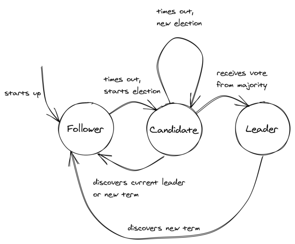

## **Chapter 9** 

## **Leader election** 

There are times when a single process in the system needs to have special powers, like accessing a shared resource or assigning work to others. To grant a process these powers, the system needs to elect a _leader_ among a set of _candidate processes_ , which remains in charge until it relinquishes its role or becomes otherwise unavailable. When that happens, the remaining processes can elect a new leader among themselves. 

A leader election algorithm needs to guarantee that there is at most one leader at any given time and that an election eventually completes even in the presence of failures. These two properties are also referred to as _safety_ and _liveness_ , respectively, and they are general properties of distributed algorithms. Informally, safety guarantees that nothing bad happens and liveness that something good eventually does happen. In this chapter, we will explore how a specific algorithm, the _Raft_ leader election algorithm, guarantees these properties. 

72 

## **9.1 Raft leader election** 

Raft[1] ’s leader election algorithm is implemented as a state machine in which any process is in one of three states (see Figure 9.1): 

- the _follower state_ , where the process recognizes another one as the leader; 

- the _candidate state_ , where the process starts a new election proposing itself as a leader; 

- or the _leader state_ , where the process is the leader. 

In Raft, time is divided into _election terms_ of arbitrary length that are numbered with consecutive integers (i.e., logical timestamps). A term begins with a new election, during which one or more candidates attempt to become the leader. The algorithm guarantees that there is at most one leader for any term. But what triggers an election in the first place? 

When the system starts up, all processes begin their journey as followers. A follower expects to receive a periodic heartbeat from the leader containing the election term the leader was elected in. If the follower doesn’t receive a heartbeat within a certain period of time, a timeout fires and the leader is presumed dead. At that point, the follower starts a new election by incrementing the current term and transitioning to the candidate state. It then votes for itself and sends a request to all the processes in the system to vote for it, stamping the request with the current election term. 

The process remains in the candidate state until one of three things happens: it wins the election, another process wins the election, or some time goes by with no winner: 

- **The candidate wins the election** — The candidate wins the election if the majority of processes in the system vote for it. Each process can vote for at most one candidate in a term on a first-come-first-served basis. This majority rule enforces that at most one candidate can win a term. If the candidate wins the election, it transitions to the leader state and starts 

> 1“In Search of an Understandable Consensus Algorithm,” https://raft.github. io/raft.pdf 

73 sending heartbeats to the other processes. 

- **Another process wins the election** — If the candidate receives a heartbeat from a process that claims to be the leader with a term greater than or equal to the candidate’s term, it accepts the new leader and returns to the follower state.[2] If not, it continues in the candidate state. You might be wondering how that could happen; for example, if the candidate process was to stop for any reason, like for a long garbage collection pause, by the time it resumes another process could have won the election. 

- **A period of time goes by with no winner** — It’s unlikely but possible that multiple followers become candidates simultaneously, and none manages to receive a majority of votes; this is referred to as a split vote. The candidate will eventually time out and start a new election when that happens. The election timeout is picked randomly from a fixed interval to reduce the likelihood of another split vote in the next election. 

## **9.2 Practical considerations** 

There are other leader election algorithms out there, but Raft’s implementation is simple to understand and also widely used in practice, which is why I chose it for this book. In practice, you will rarely, if ever, need to implement leader election from scratch. A good reason for doing that would be if you needed a solution with zero external dependencies[3] . Instead, you can use any _fault-tolerant_ key-value store that offers a linearizable[4] _compare-and-swap_[5] operation with an expiration time (TTL). 

The compare-and-swap operation atomically updates the value of a key if and only if the process attempting to update the value correctly identifies the current value. The operation takes three pa- 

> 2The same happens if the leader receives a heartbeat with a greater term. 

> 3We will encounter one such case when discussing replication in the next chap- 

> ter. 

> 4 We will define what linearizability means exactly later in section 10.3.1. 

> 5“Compare-and-swap,” https://en.wikipedia.org/wiki/Compare-and-swap 

74 

Figure 9.1: Raft’s leader election algorithm represented as a state machine. rameters: 𝐾, 𝑉𝑜, and 𝑉𝑛, where 𝐾 is a key, and 𝑉𝑜 and 𝑉𝑛 are values referred to as the old and new value, respectively. The operation atomically compares the current value of 𝐾 with 𝑉𝑜, and if they match, it updates the value of 𝐾 to 𝑉𝑛. If the values don’t match, then 𝐾 is not modified, and the operation fails. 

The expiration time defines the time to live for a key, after which the key expires and is removed from the store unless the expiration time is extended. The idea is that each competing process tries to acquire a _lease_ by creating a new key with compare-and-swap. The first process to succeed becomes the leader and remains such until it stops renewing the lease, after which another process can become the leader. 

The expiration logic can also be implemented on the client side, 

75 like this locking library[6] for DynamoDB does, but the implementation is more complex, and it still requires the data store to offer a compare-and-swap operation. 

You might think that’s enough to guarantee there can’t be more than one leader at any given time. But, unfortunately, that’s not the case. To see why suppose multiple processes need to update a file on a shared file store, and we want to guarantee that only one at a time can access it to avoid race conditions. Now, suppose we use a lease to lock the critical section. Each process tries to acquire the lease, and the one that does so successfully reads the file, updates it in memory, and writes it back to the store: 

## **if** lease.acquire(): 

**try** : content = store.read(filename) new_content = update(content) store.write(filename, new_content) 

## **except** : 

lease.release() 

The issue is that by the time the process gets to write to the file, it might no longer hold the lease. For example, the operating system might have preempted and stopped the process for long enough for the lease to expire. The process could try to detect that by comparing the lease expiration time to its local clock before writing to the store, assuming clocks are synchronized. 

However, clock synchronization isn’t perfectly accurate. On top of that, the lease could expire while the request to the store is in-flight because of a network delay. To account for these problems, the process could check that the lease expiration is far enough in the future before writing to the file. Unfortunately, this workaround isn’t foolproof, and the lease can’t guarantee mutual exclusion by itself. 

To solve this problem, we can assign a version number to each file 

> 6“Building Distributed Locks with the DynamoDB Lock Client,” https://aws. amazon.com/blogs/database/building-distributed-locks-with-the-dynamodblock-client/ 

76 that is incremented every time the file is updated. The process holding the lease can then read the file and its version number from the file store, do some local computation, and finally update the file (and increment the version number) conditional on the version number not having changed. The process can perform this validation atomically using a compare-and-swap operation, which many file stores support. 

If the file store doesn’t support conditional writes, we have to design around the fact that occasionally there will be a race condition. Sometimes, that’s acceptable; for example, if there are momentarily two leaders and they both perform the same idempotent update, no harm is done. 

Although having a leader can simplify the design of a system as it eliminates concurrency, it can also become a scalability bottleneck if the number of operations performed by it increases to the point where it can no longer keep up. Also, a leader is a single point of failure with a large blast radius; if the election process stops working or the leader isn’t working as expected, it can bring down the entire system with it. We can mitigate some of these downsides by introducing partitions and assigning a different leader per partition, but that comes with additional complexity. This is the solution many distributed data stores use since they need to use partitioning anyway to store data that doesn’t fit in a single node. 

As a rule of thumb, if we must have a leader, we have to minimize the work it performs and be prepared to occasionally have more than one. 

Taking a step back, a crucial assumption we made earlier is that the data store that holds leases is fault-tolerant, i.e., it can tolerate the loss of a node. Otherwise, if the data store ran on a single node and that node were to fail, we wouldn’t be able to acquire leases. For the data store to withstand a node failing, it needs to replicate its state over multiple nodes. In the next chapter, we will take a closer look at how this can be accomplished. 

