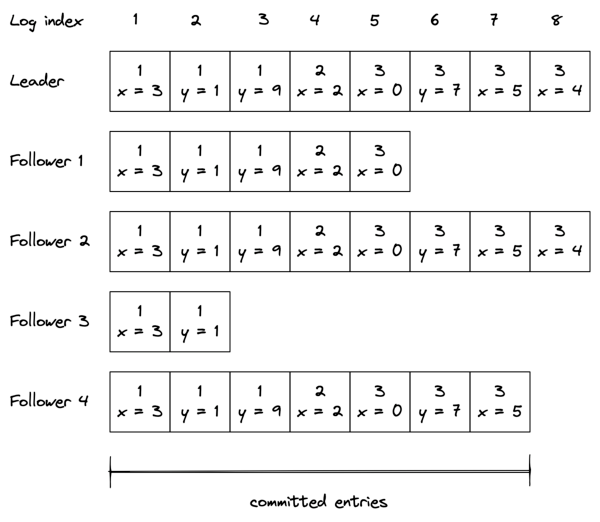
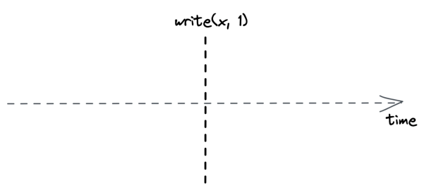
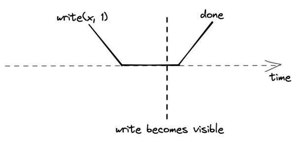
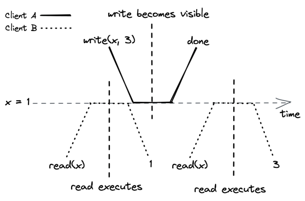
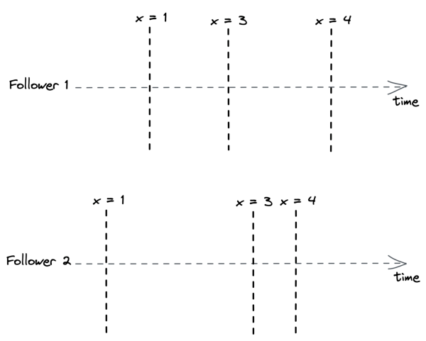
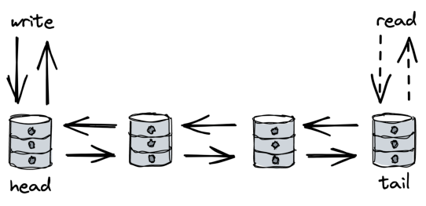
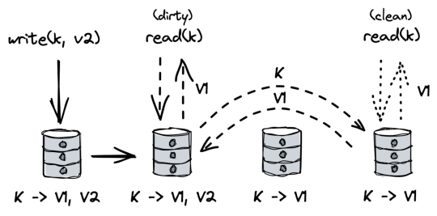

# **Chapter 10** 

# **Replication** 

Data replication is a fundamental building block of distributed systems. One reason for replicating data is to increase availability. If some data is stored exclusively on a single process, and that process goes down, the data won’t be accessible anymore. However, if the data is replicated, clients can seamlessly switch to a copy. Another reason for replication is to increase scalability and performance; the more replicas there are, the more clients can access the data concurrently. 

Implementing replication is challenging because it requires keeping replicas consistent with one another even in the face of failures. In this chapter, we will explore Raft’s replication algorithm[1] , a replication protocol that provides the strongest consistency guarantee possible — the guarantee that to the clients, the data appears to be stored on a single process, even if it’s actually replicated. Arguably, the most popular protocol that offers this guarantee is Paxos[2] , but we will discuss Raft as it’s more understandable. 

Raft is based on a mechanism known as _state machine replication_ . The main idea is that a single process, the leader, _broadcasts_ op- 

> 1“In Search of an Understandable Consensus Algorithm,” https://raft.github. io/raft.pdf 

> 2“Paxos Made Simple,” https://lamport.azurewebsites.net/pubs/paxossimple.pdf 

78 erations that change its state to other processes, the followers (or replicas). If the followers execute the same sequence of operations as the leader, then each follower will end up in the same state as the leader. Unfortunately, the leader can’t simply broadcast operations to the followers and call it a day, as any process can fail at any time, and the network can lose messages. This is why a large part of the algorithm is dedicated to fault tolerance. 

The reason why this this mechanism is called stated machine replication is that each process is modeled as a _state machine_[3] that transitions from one state to another in response to some input (an operation). If the state machines are _deterministic_ and get exactly the same input in the same order, their states are consistent. That way, if one of them fails, a redundant copy is available from any of the other state machines. State machine replication is a very powerful tool to make a service fault-tolerant as long it can be modeled as a state machine. 

For example, consider the problem of implementing a faulttolerant key-value store. In this case, each state machine represents a storage node that accepts _put(k, v)_ and _get(k)_ operations. The actual state is represented with a dictionary. When a _put_ operation is executed, the key-value pair is added to the dictionary. When a _get_ operation is executed, the value corresponding to the requested key is returned. You can see how if every node executes the same sequence of _puts_ , all nodes will end up having the same state. 

In the next section, we will take a deeper look at Raft’s replication protocol. It’s a challenging read that requires to pause and think, but I can assure you it’s well worth the effort, especially if you haven’t seen a replication protocol before. 

# **10.1 State machine replication** 

When the system starts up, a leader is elected using Raft’s leader election algorithm discussed in chapter 9, which doesn’t require 

3“Finite-state machine,” https://en.wikipedia.org/wiki/Finite-state_machine 

79 any external dependencies. The leader is the only process that can change the replicated state. It does so by storing the sequence of operations that alter the state into a local _log_ , which it replicates to the followers. Replicating the log is what allows the state to be kept in sync across processes. 

As shown in Figure 10.1, a log is an ordered list of entries where each entry includes: 

- the operation to be applied to the state, like the assignment of 3 to x. The operation needs to be deterministic so that all followers end up in the same state, but it can be arbitrarily complex as long as that requirement is respected (e.g., compareand-swap or a transaction with multiple operations); 

- the index of the entry’s position in the log; 

- and the leader’s election term (the number in each box). 

Figure 10.1: The leader’s log is replicated to its followers. 

When the leader wants to apply an operation to its local state, it 

80 first appends a new entry for the operation to its log. At this point, the operation hasn’t been applied to the local state just yet; it has only been logged. 

The leader then sends an _AppendEntries_ request to each follower with the new entry to be added. This message is also sent out periodically, even in the absence of new entries, as it acts as a _heartbeat_ for the leader. 

When a follower receives an _AppendEntries_ request, it appends the entry it received to its own log (without actually executing the operation yet) and sends back a response to the leader to acknowledge that the request was successful. When the leader hears back successfully from a majority of followers, it considers the entry to be committed and executes the operation on its local state. The leader keeps track of the highest committed index in the log, which is sent in all future _AppendEntries_ requests. A follower only applies a log entry to its local state when it finds out that the leader has committed the entry. 

Because the leader needs to wait for _only_ a majority (quorum) of followers, it can make progress even if some are down, i.e., if there are 2𝑓+ 1 followers, the system can tolerate up to 𝑓 failures. The algorithm guarantees that an entry that is committed is durable and will eventually be executed by all the processes in the system, not just those that were part of the original majority. 

So far, we have assumed there are no failures, and the network is reliable. Let’s relax those assumptions. If the leader fails, a follower is elected as the new leader. But, there is a caveat: because the replication algorithm only needs a majority of processes to make progress, it’s possible that some processes are not up to date when a leader fails. To avoid an out-of-date process becoming the leader, a process can’t vote for one with a less up-to-date log. In other words, a process can’t win an election if it doesn’t contain all committed entries. 

To determine which of two processes’ logs is more up-to-date, the election term and index of their last entries are compared. If the logs end with different terms, the log with the higher term is more 

81 up to date. If the logs end with the same term, whichever log is longer is more up to date. Since the election requires a majority vote, and a candidate’s log must be at least as up to date as any other process in that majority to win the election, the elected process will contain all committed entries. 

If an _AppendEntries_ request can’t be delivered to one or more followers, the leader will retry sending it indefinitely until a majority of the followers have successfully appended it to their logs. Retries are harmless as _AppendEntries_ requests are idempotent, and followers ignore log entries that have already been appended to their logs. 

If a follower that was temporarily unavailable comes back online, it will eventually receive an _AppendEntries_ message with a log entry from the leader. The _AppendEntries_ message includes the index and term number of the entry in the log that immediately precedes the one to be appended. If the follower can’t find a log entry with that index and term number, it rejects the message to prevent creating a gap in its log. 

When the _AppendEntries_ request is rejected, the leader retries the request, this time including the last two log entries — this is why we referred to the request as _AppendEntries_ and not as _AppendEntry_ . If that fails, the leader retries sending the last three log entries and so forth.[4] The goal is for the leader to find the latest log entry where the two logs agree, delete any entries in the follower’s log after that point, and append to the follower’s log all of the leader’s entries after it. 

# **10.2 Consensus** 

By solving state machine replication, we actually found a solution to _consensus_[5] — a fundamental problem studied in distributed systems research in which a group of processes has to decide a value 

> 4In practice, there are ways to reduce the number of messages required for this step. 

> 5“Consensus,” https://en.wikipedia.org/wiki/Consensus_(computer_scien ce) 

82 

# so that: 

- every non-faulty process eventually agrees on a value; 

- the final decision of every non-faulty process is the same everywhere; 

- and the value that has been agreed on has been proposed by a process. 

This may sound a little bit abstract. Another way to think about consensus is as the API of a write-once register[6] (WOR): a threadsafe and linearizable[7] register that can only be written once but can be read many times. 

There are plenty of practical applications of consensus. For example, agreeing on which process in a group can acquire a lease requires consensus. And, as mentioned earlier, state machine replication also requires it. If you squint a little, you should be able to see how the replicated log in Raft is a sequence of WORs, and so Raft really is just a sequence of consensus instances. 

While it’s important to understand what consensus is and how it can be solved, you will likely never need to implement it from scratch[8] . Instead, you can use one of the many off-the-shelf solutions available. 

For example, one of the most common uses of consensus is for coordination purposes, like the election of a leader. As discussed in 9.2, leader election can be implemented by acquiring a lease. The lease ensures that at most one process can be the leader at any time and if the process dies, another one can take its place. However, this mechanism requires the lease manager, or coordination service, to be fault-tolerant. Etcd[9] and ZooKeeper[10] are two widely used co- 

> 6“Paxos made Abstract,” https://maheshba.bitbucket.io/blog/2021/11/15/ Paxos.html 

> 7We will define what linearizability means in the next section. 

> 8nor want to, since it’s very challenging to get right; see “Paxos Made Live - An Engineering Perspective,” https://static.googleusercontent.com/media/research. google.com/en//archive/paxos_made_live.pdf 

> 9“etcd: A distributed, reliable key-value store for the most critical data of a distributed system,” https://etcd.io/ 

> 10“Apache ZooKeeper: An open-source server which enables highly reliable distributed coordination,” https://zookeeper.apache.org/ 

83 ordination services that replicate their state for fault-tolerance using consensus. A coordination service exposes a hierarchical, keyvalue store through its API, and also allows clients to watch for changes to keys. So, for example, acquiring a lease can be implemented by having a client attempt to create a key with a specific TTL. If the key already exists, the operation fails guaranteeing that only one client can acquire the lease. 

# **10.3 Consistency models** 

We discussed state machine replication with the goal of implementing a data store that can withstand failures and scale out to serve a larger number of requests. Now that we know how to build a replicated data store in principle, let’s take a closer look at what happens when a client sends a request to it. In an ideal world, the request executes instantaneously, as shown in Figure 10.2. 

Figure 10.2: A write request executing instantaneously 

But in reality, things are quite different — the request needs to reach the leader, which has to process it and send back a response to the client. As shown in Figure 10.3, these actions take time and are not instantaneous. 

The best guarantee the system can provide is that the request executes somewhere between its invocation and completion time. You might think that this doesn’t look like a big deal; after all, it’s 

84 

Figure 10.3: A write request can’t execute instantaneously because it takes time to reach the leader and be executed. what you are used to when writing single-threaded applications. For example, if you assign 42 to x and read its value immediately afterward, you expect to find 42 in there, assuming there is no other thread writing to the same variable. But when you deal with replicated systems, all bets are off. Let’s see why that’s the case. 

In section 10.1, we looked at how Raft replicates the leader’s state to its followers. Since only the leader can make changes to the state, any operation that modifies it needs to necessarily go through the leader. But what about reads? They don’t necessarily have to go through the leader as they don’t affect the system’s state. Reads can be served by the leader, a follower, or a combination of leader and followers. If all reads have to go through the leader, the read throughput would be limited to that of a single process. But, if any follower can serve reads instead, then two clients, or observers, can have a different view of the system’s state since followers can lag behind the leader. 

Intuitively, there is a tradeoff between how consistent the observers’ views of the system are and the system’s performance and availability. To understand this relationship, we need to define precisely what we mean by consistency. We will do so with 

85 the help of _consistency models_[11] , which formally define the possible views the observers can have of the system’s state. 

# **10.3.1 Strong consistency** 

If clients send writes and reads exclusively to the leader, then every request appears to take place atomically at a very specific point in time as if there were a single copy of the data. No matter how many replicas there are or how far behind they are lagging, as long as the clients always query the leader directly, there is a single copy of the data from their point of view. 

Because a request is not served instantaneously, and there is a single process that can serve it, the request executes somewhere between its invocation and completion time. By the time it completes, its side-effects are visible to all observers, as shown in Figure 10.4. 

Figure 10.4: The side-effects of a strongly consistent operation are visible to all observers once it completes. 

Since a request becomes visible to all other participants between its invocation and completion time, a real-time guarantee must 

> 11“Consistency Models,” https://jepsen.io/consistency 

86 be enforced; this guarantee is formalized by a consistency model called _linearizability_[12] , or _strong consistency_ . Linearizability is the strongest consistency guarantee a system can provide for singleobject requests.[13] 

Unfortunately, the leader can’t serve reads directly from its local state because by the time it receives a request from a client, it might no longer be the leader; so, if it were to serve the request, the system wouldn’t be strongly consistent. The presumed leader first needs to contact a majority of replicas to confirm whether it still is the leader. Only then is it allowed to execute the request and send back a response to the client. Otherwise, it transitions to the follower state and fails the request. This confirmation step considerably increases the time required to serve a read. 

# **10.3.2 Sequential consistency** 

So far, we have discussed serializing all reads through the leader. But doing so creates a single chokepoint, limiting the system’s throughput. On top of that, the leader needs to contact a majority of followers to handle a read, which increases the time it takes to process a request. To increase the read performance, we could also allow the followers to handle requests. 

Even though a follower can lag behind the leader, it will always receive new updates in the same order as the leader. For example, suppose one client only ever queries follower 1, and another only ever queries follower 2. In that case, the two clients will see the state evolving at different times, as followers are not perfectly in sync (see Figure 10.5). 

The consistency model that ensures operations occur in the same order for all observers, but doesn’t provide any real-time guarantee about when an operation’s side-effect becomes visible to them, is called _sequential consistency_[14] . The lack of real-time guarantees is 

> 12“Linearizability,” https://jepsen.io/consistency/models/linearizable 

> 13For example, this is the guarantee you would expect from a coordination service that manages leases. 

> 14“Sequential Consistency,” https://jepsen.io/consistency/models/sequential 

87 

Figure 10.5: Although followers have a different view of the system’s state, they process updates in the same order. what differentiates sequential consistency from linearizability. 

A producer/consumer system synchronized with a queue is an example of this model; a producer writes items to the queue, which a consumer reads. The producer and the consumer see the items in the same order, but the consumer lags behind the producer. 

# **10.3.3 Eventual consistency** 

Although we managed to increase the read throughput, we had to pin clients to followers — if a follower becomes unavailable, the client loses access to the store. We could increase the availability by allowing the client to query any follower. But this comes at a steep price in terms of consistency. For example, say there are two followers, 1 and 2, where follower 2 lags behind follower 1. If a client queries follower 1 and then follower 2, it will see an earlier state, which can be very confusing. The only guarantee the client 

88 has is that eventually all followers will converge to the final state if writes to the system stop. This consistency model is called _eventual consistency_ . 

It’s challenging to build applications on top of an eventually consistent data store because the behavior is different from what we are used to when writing single-threaded applications. As a result, subtle bugs can creep up that are hard to debug and reproduce. Yet, in eventual consistency’s defense, not all applications require linearizability. For example, an eventually consistent store is perfectly fine if we want to keep track of the number of users visiting a website, since it doesn’t really matter if a read returns a number that is slightly out of date. 

# **10.3.4 The CAP theorem** 

When a network partition happens, parts of the system become disconnected from each other. For example, some clients might no longer be able to reach the leader. The system has two choices when this happens; it can either: 

- remain available by allowing clients to query followers that are reachable, sacrificing strong consistency; 

- or guarantee strong consistency by failing reads that can’t reach the leader. 

This concept is expressed by the _CAP theorem_[15] , which can be summarized as: “strong consistency, availability and partition tolerance: pick two out of three.” In reality, the choice really is only between strong consistency and availability, as network faults are a given and can’t be avoided. 

Confusingly enough, the CAP theorem’s definition of availability requires that every request _eventually_ receives a response. But in real systems, achieving perfect availability is impossible. Moreover, a very slow response is just as bad as one that never occurs. So, in other words, many highly-available systems can’t be con- 

> 15“Perspectives on the CAP Theorem,” https://groups.csail.mit.edu/tds/paper s/Gilbert/Brewer2.pdf 

89 sidered available as defined by the CAP theorem. Similarly, the theorem’s definition of consistency and partition tolerance is very precise, limiting its practical applications.[16] A more useful way to think about the relationship between availability and consistency is as a spectrum. And so, for example, a strongly consistent and partition-tolerant system as defined by the CAP theorem occupies just one point in that spectrum.[17] 

Also, even though network partitions can happen, they are usually rare within a data center. But, even in the absence of a network partition, there is a tradeoff between consistency and _latency_ (or performance). The stronger the consistency guarantee is, the higher the latency of individual operations must be. This relationship is expressed by the _PACELC theorem_[18] , an extension to the CAP theorem. It states that in case of network partitioning (P), one has to choose between availability (A) and consistency (C), but else (E), even when the system is running normally in the absence of partitions, one has to choose between latency (L) and consistency (C). In practice, the choice between latency and consistency is not binary but rather a spectrum. 

This is why some off-the-shelf distributed data stores come with counter-intuitive consistency guarantees in order to provide high availability and performance. Others have knobs that allow you to choose whether you want better performance or stronger consistency guarantees, like Azure’s Cosmos DB[19] and Cassandra[20] . 

Another way to interpret the PACELC theorem is that there is a tradeoff between the amount of coordination required and performance. One way to design around this fundamental limitation is 

> 16“A Critique of the CAP Theorem,” https://www.cl.cam.ac.uk/research/dtg/ www/files/publications/public/mk428/cap-critique.pdf 

> 17“CAP Theorem: You don’t need CP, you don’t want AP, and you can’t have CA,” https://www.youtube.com/watch?v=hUd_9FENShA 

> 18“Consistency Tradeoffs in Modern Distributed Database System Design,” https: //en.wikipedia.org/wiki/PACELC_theorem 

> 19“Consistency levels in Azure Cosmos DB,” https://docs.microsoft.com/enus/azure/cosmos-db/consistency-levels 

> 20“Apache Cassandra: How is the consistency level configured?,” https://docs .datastax.com/en/cassandra-oss/3.0/cassandra/dml/dmlConfigConsistency.h tml 

90 to move coordination away from the critical path. For example, earlier we discussed that for a read to be strongly consistent, the leader has to contact a majority of followers. That coordination tax is paid for each read! In the next section, we will explore a different replication protocol that moves this cost away from the critical path. 

# **10.4 Chain replication** 

Chain replication[21] is a widely used replication protocol that uses a very different topology from leader-based replication protocols like Raft. In chain replication, processes are arranged in a chain. The leftmost process is referred to as the chain’s _head_ , while the rightmost one is the chain’s _tail_ . 

Clients send writes exclusively to the head, which updates its local state and forwards the update to the next process in the chain. Similarly, that process updates its state and forwards the change to its successor until it eventually reaches the tail. 

When the tail receives an update, it applies it locally and sends an acknowledgment to its predecessor to signal that the change has been committed. The acknowledgment flows back to the head, which can then reply to the client that the write succeeded[22] . 

Client reads are served exclusively by the tail, as shown in Fig 10.6. In the absence of failures, the protocol is strongly consistent as all writes and reads are processed one at a time by the tail. But what happens if a process in the chain fails? 

Fault tolerance is delegated to a dedicated component, the configuration manager or _control plane_ . At a high level, the control plane monitors the chain’s health, and when it detects a faulty process, it removes it from the chain. The control plane ensures that there is a 

> 21“Chain Replication for Supporting High Throughput and Availability,” https: //www.cs.cornell.edu/home/rvr/papers/OSDI04.pdf 

> 22This is slightly different from the original chain replication paper since it’s based on CRAQ, an extension of the original protocol; see “Object Storage on CRAQ,” https://www.usenix.org/legacy/event/usenix09/tech/full_paper s/terrace/terrace.pdf. 

91 

Figure 10.6: Writes propagate through all processes in the chain, while reads are served exclusively by the tail. single view of the chain’s topology that every process agrees with. For this to work, the control plane needs to be fault-tolerant, which requires state machine replication (e.g., Raft). So while the chain can tolerate up to N −1 processes failing, where N is the chain’s length, the control plane can only tolerate[𝐶] 2[failures,][where][C][is] the number of replicas that make up the control plane. 

There are three failure modes in chain replication: the head can fail, the tail can fail, or an intermediate process can fail. If the head fails, the control plane removes it by reconfiguring its successor to be the new head and notifying clients of the change. If the head committed a write to its local state but crashed before forwarding it downstream, no harm is done. Since the write didn’t reach the tail, the client that issued it hasn’t received an acknowledgment for it yet. From the client’s perspective, it’s just a request that timed out and needs to be retried. Similarly, no other client will have seen the write’s side effects since it never reached the tail. 

If the tail fails, the control plane removes it and makes its predecessor the chain’s new tail. Because all updates that the tail has received must necessarily have been received by the predecessor as well, everything works as expected. 

If an intermediate process _X_ fails, the control plane has to link _X_ ’s predecessor with _X_ ’s successor. This case is a bit trickier to handle 

92 since _X_ might have applied some updates locally but failed before forwarding them to its successor. Therefore, _X_ ’s successor needs to communicate to the control plane the sequence number of the last committed update it has seen, which is then passed to _X_ ’s predecessor to send the missing updates downstream. 

Chain replication can tolerate up to N −1 failures. So, as more processes in the chain fail, it can tolerate fewer failures. This is why it’s important to replace a failing process with a new one. This can be accomplished by making the new process the tail of the chain after syncing it with its predecessor. 

The beauty of chain replication is that there are only a handful of simple failure modes to consider. That’s because for a write to commit, it needs to reach the tail, and consequently, it must have been processed by every process in the chain. This is very different from a quorum-based replication protocol like Raft, where only a subset of replicas may have seen a committed write. 

Chain replication is simpler to understand and more performant than leader-based replication since the leader’s job of serving client requests is split among the head and the tail. The head sequences writes by updating its local state and forwarding updates to its successor. Reads, however, are served by the tail, and are interleaved with updates received from its predecessor. Unlike in Raft, a read request from a client can be served immediately from the tail’s local state without contacting the other replicas first, which allows for higher throughputs and lower response times. 

However, there is a price to pay in terms of write latency. Since an update needs to go through all the processes in the chain before it can be considered committed, a single slow replica can slow down all writes. In contrast, in Raft, the leader only has to wait for a majority of processes to reply and therefore is more resilient to transient degradations. Additionally, if a process isn’t available, chain replication can’t commit writes until the control plane detects the problem and takes the failing process out of the chain. In Raft instead, a single process failing doesn’t stop writes from being committed since only a quorum of processes is needed to make 

93 

# progress. 

That said, chain replication allows write requests to be pipelined, which can significantly improve throughput. Moreover, read throughput can be further increased by distributing reads across replicas while still guaranteeing linearizability. The idea is for replicas to store multiple versions of an object, each including a version number and a dirty flag. Replicas mark an update as dirty as it propagates from the head to the tail. Once the tail receives it, it’s considered committed, and the tail sends an acknowledgment back along the chain. When a replica receives an acknowledgment, it marks the corresponding version as clean. Now, when a replica receives a read request for an object, it will immediately serve it if the latest version is clean. If not, it first contacts the tail to request the latest committed version (see Fig 10.7). 

Figure 10.7: A dirty read can be served by any replica with an additional request to the tail to guarantee strong consistency. 

As discussed in chapter 9, a leader introduces a scalability bottleneck. But in chain replication, the data plane (i.e., the part of the system that handles individual client requests on the critical path) doesn’t need a leader to do its job since it’s not concerned with failures — its sole focus is throughput and efficiency. On the contrary, the control plane needs a leader to implement state machine replication, but that’s required exclusively to handle the occasional failure and doesn’t affect client requests on the critical path. An94 other way to think about this is that chain replication reduces the amount of coordination needed for each client request. In turn, this increases the data plane’s capacity to handle load. For this reason, splitting the data plane from the control plane (i.e., the configuration management part) is a common pattern in distributed systems. We will talk in more detail about this in chapter 22. 

You might be wondering at this point whether it’s possible to replicate data without needing consensus[23] at all to improve performance further. In the next chapter, we will try to do just that. 

23required for state machine replication 

