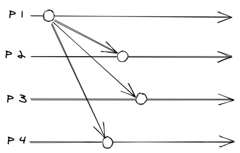
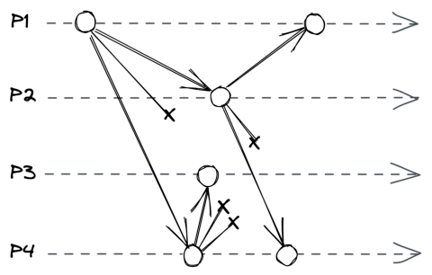
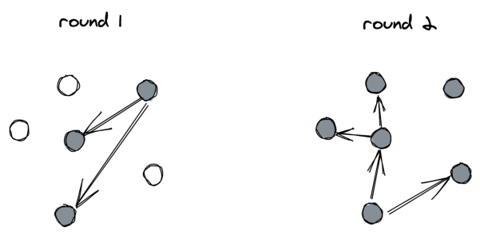
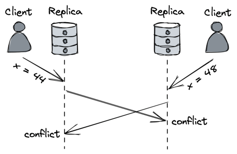
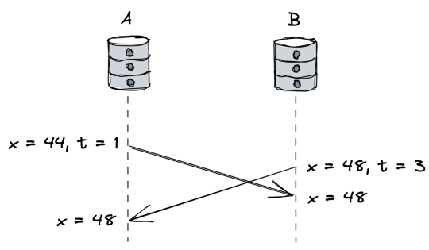
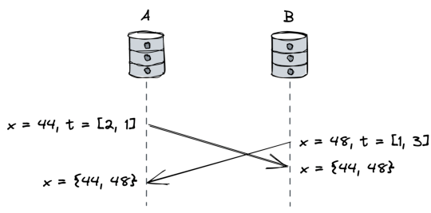
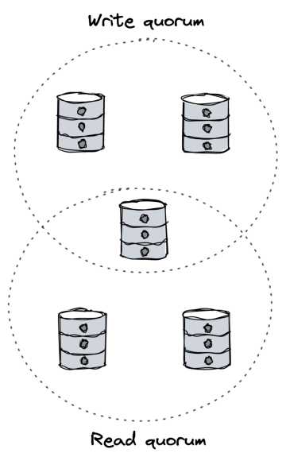
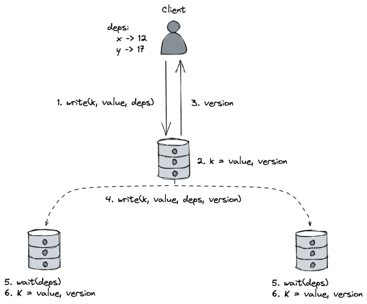

# **Chapter 11** 

# **Coordination avoidance** 

Another way of looking at state machine replication is as a system that requires two main ingredients: 

- a _broadcast protocol_ that guarantees every replica receives the same updates in the same order even in the presence of faults (aka _fault-tolerant total order broadcast_ ), 

- and a deterministic function that handles updates on each replica. 

Unsurprisingly, implementing a fault-tolerant total order broadcast protocol is what makes state machine replication hard to solve since it requires consensus[1] . More importantly, the need for a total order creates a scalability bottleneck since updates need to be processed sequentially by a single process (e.g., the leader in Raft). Also, total order broadcast isn’t available during network partitions as the CAP theorem applies[2] to it as well[3] . 

In this chapter, we will explore a form of replication that doesn’t 

> 1Total order broadcast is equivalent to consensus, see “Unreliable Failure Detectors for Reliable Distributed Systems,” https://www.cs.utexas.edu/~lorenzo/cor si/cs380d/papers/p225-chandra.pdf 

> 2“Perspectives on the CAP Theorem,” https://groups.csail.mit.edu/tds/paper s/Gilbert/Brewer2.pdf 

> 3Consensus is harder to solve than implementing a linearizable read/write register, which is what the CAP theorem uses to define consistency. 

96 require a total order but still comes with useful guarantees. But first, we need to talk about broadcast protocols. 

# **11.1 Broadcast protocols** 

Network communication over wide area networks, like the internet, only offers point-to-point (unicast) communication protocols, like TCP. But to deliver a message to a group of processes, a broadcast protocol is needed (multicast). This means we have to somehow build a multicast protocol on top of a unicast one. The challenge here is that multicast needs to support multiple senders and receivers that can crash at any time. 

A broadcast protocol is characterized by the guarantees it provides. _Best-effort broadcast_ guarantees that if the sender doesn’t crash, the message is delivered to all non-faulty processes in a group. A simple way to implement it is to send the message to all processes in a group one by one over reliable links (see Fig 11.1). However, if, for example, the sender fails mid-way, some processes will never receive the message. 

Figure 11.1: Best-effort broadcast 

Unlike best-effort broadcast, _reliable broadcast_ guarantees that the message is eventually delivered to all non-faulty processes in the group, even if the sender crashes before the message has been fully 

97 delivered. One way to implement reliable broadcast is to have each process retransmit the message to the rest of the group the first time it is delivered (see Fig 11.2). This approach is also known as _eager reliable broadcast_ . Although it guarantees that all non-faulty processes eventually receive the message, it’s costly as it requires sending the message 𝑁[2] times for a group of 𝑁 processes. 

Figure 11.2: Eager reliable broadcast 

The number of messages can be reduced by retransmitting a message only to a random subset of processes (e.g., 2 as in Fig 11.3). This implementation is referred to as a _gossip broadcast protocol_[4] as it resembles how rumors spread. Because it’s a probabilistic protocol, it doesn’t guarantee that a message will be delivered to all processes. That said, it’s possible to make that probability negligible by tuning the protocol’s parameters. Gossip protocols are particularly useful when broadcasting to a large number of processes where a deterministic protocol just wouldn’t scale. 

Although reliable broadcast protocols guarantee that messages are delivered to all non-faulty processes in a group, they don’t make any guarantees about their order. For example, two processes could receive the same messages but in a different order. _Total order broadcast_ is a reliable broadcast abstraction that builds upon the guarantees offered by reliable broadcast and additionally 

4“Gossip protocol,” https://en.wikipedia.org/wiki/Gossip_protocol 

98 

Figure 11.3: Gossip broadcast ensures that messages are delivered in the same order to all processes. As discussed earlier, a fault-tolerant implementation requires consensus. 

# **11.2 Conflict-free replicated data types** 

Now, here’s an idea: if we were to implement replication with a broadcast protocol that doesn’t guarantee total order, we wouldn’t need to serialize writes through a single leader, but instead could allow any replica to accept writes. But since replicas might receive messages in different orders, they will inevitably diverge. So, for the replication to be useful, the divergence can only be temporary, and replicas eventually have to converge to the same state. This is the essence of eventual consistency. 

More formally, eventual consistency requires: 

- _eventual delivery_ — the guarantee that every update applied at a replica is eventually applied at all replicas, 

- and _convergence_ — the guarantee that replicas that have applied the same updates _eventually_ reach the same state. 

Using a broadcast protocol that doesn’t deliver messages in the same order across all replicas will inevitably lead to divergence 

99 

(see Fig 11.4). One way to reconcile conflicting writes is to use consensus to make a decision that all replicas need to agree with. 

Figure 11.4: The same object is updated simultaneously by different clients at different replicas, leading to conflicts. 

This solution has better availability and performance than the one using total order broadcast, since consensus is only required to reconcile conflicts and can happen off the critical path. But getting the reconciliation logic right isn’t trivial. So is there a way for replicas to solve conflicts without using consensus at all? 

Well, if we can define a deterministic outcome for any potential conflict (e.g., the write with the greatest timestamp always wins), there wouldn’t be any conflicts, by design. Therefore consensus wouldn’t be needed to reconcile replicas. Such a replication strategy offers stronger guarantees than plain eventual consistency, i.e.: 

- _eventual delivery_ — the same guarantee as in eventual consistency, 

- and _strong convergence_ — the guarantee that replicas that have executed the same updates _have_ the same state (i.e., every update is immediately persisted). 

This variation of eventual consistency is also called _strong even-_ 

100 

_tual consistency_[5] . With it, we can build systems that are available, (strongly eventual) consistent, and also partition tolerant. 

Which conditions are required to guarantee that replicas strongly converge? For example, suppose we replicate an object across N replicas, where the object is an instance of some data type that supports _query_ and _update_ operations (e.g., integer, string, set, etc.). 

A client can send an update or query operation to any replica, and: 

- when a replica receives a query, it immediately replies using the local copy of the object; 

- when a replica receives an update, it first applies it to the local copy of the object and then broadcasts the updated object to all replicas; 

- and when a replica receives a broadcast message, it _merges_ the object in the message with its own. 

It can be shown that each replica will converge to the same state if: 

- the object’s possible states form a semilattice, i.e., a set that contains elements that can be partially ordered; 

- and the merge operation returns the least upper bound between two objects’ states (and therefore is idempotent, commutative, and associative). 

A data type that has these properties is also called a convergent replicated data type[6] , which is part of the family of _conflict-free replicated data types_ (CRDTs). This sounds a lot more complicated than it actually is. 

For example, suppose we are working with integer objects (which can be partially ordered), and the merge operation takes the maximum of two objects (least upper bound). It’s easy to see how replicas converge to the global maximum in this case, even if requests are delivered out of order and/or multiple times across replicas. 

> 5“Strong Eventual Consistency and Conflict-free Replicated Data Types,” https: //www.microsoft.com/en-us/research/video/strong-eventual-consistency-andconflict-free-replicated-data-types/ 

> 6“Conflict-free Replicated Data Types,” https://hal.inria.fr/inria-00609399v1 /document 

101 

Although we have assumed the use of a reliable broadcast protocol so far, replicas could even use an unreliable protocol to implement broadcast as long as they periodically exchange and merge their states to ensure that they eventually converge (aka an _anti-entropy mechanism_ , we will see some examples in section 11.3). Of course, periodic state exchanges can be expensive if done naively. 

There are many data types that are designed to converge when replicated, like registers, counters, sets, dictionaries, and graphs. For example, a register is a memory cell storing some opaque sequence of bytes that supports an assignment operation to overwrite its state. To make a register convergent, we need to define a partial order over its values and a merge operation. There are two common register implementations that meet these requirements: last-writer-wins (LWW) and multi-value (MV). 

A _last-writer-wins_ register associates a timestamp with every update to make updates totally orderable. The timestamp could be composed of a Lamport timestamp to preserve the _happened-before_ relationship among updates and a replica identifier to ensure there are no ties. When a replica receives an update request from a client, it generates a new timestamp and updates the register’s state with that and the new value; finally, it broadcasts the state and timestamp to all replicas. When a replica receives a register state from a peer, it merges it with its local copy by taking the one with the greater timestamp and discarding the other (see Fig 11.5). 

The main issue with LWW registers is that conflicting updates that happen concurrently are handled by taking the one with the greater timestamp, which might not always make sense. An alternative way of handling conflicts is to keep track of all concurrent updates and return them to the client application, which can handle conflicts however it sees fit. This is the approach taken by the _multi-value_ register. To detect concurrent updates, replicas tag each update with a vector clock timestamp[7] and the merge 

> 7In practice, _version vectors_ are used to compare the state of different replicas that only keep track of events that change the state of replicas, see “Detection of Mutual Inconsistency in Distributed Systems,” https://pages.cs.wisc.edu/~remzi/Class es/739/Fall2017/Papers/parker83detection.pdf. 

102 

Figure 11.5: Last-writer wins register operation returns the union of all concurrent updates (see Fig 11.6). 

Figure 11.6: Multi-value register 

The beauty of CRDTs is that they compose. So, for example, you can build a convergent key-value store by using a dictionary of LWW or MV registers. This is the approach followed by _Dynamostyle_ data stores. 

103 

# **11.3 Dynamo-style data stores** 

Dynamo[8] is arguably the best-known design of an eventually consistent and highly available key-value store. Many other data stores have been inspired by it, like Cassandra[9] and Riak KV[10] . 

In Dynamo-style data stores, every replica can accept write and read requests. When a client wants to write an entry to the data store, it sends the request to all N replicas in parallel but waits for an acknowledgment from just W replicas (a write quorum). Similarly, when a client wants to read an entry from the data store, it sends the request to all replicas but waits just for R replies (a read quorum) and returns the most recent entry to the client. To resolve conflicts, entries behave like LWW or MV registers depending on the implementation flavor. 

When W + R > N, the write quorum and the read quorum must intersect with each other, so at least one read will return the latest version (see Fig 11.7). This doesn’t guarantee linearizability on its own, though. For example, if a write succeeds on less than W replicas and fails on the others, replicas are left in an inconsistent state, and some clients might read the latest version while others don’t. To avoid this inconsistency, the writes need to be bundled into an atomic transaction. We will talk more about transactions in chapter 12. 

Typically W and R are configured to be majority quorums, i.e., quorums that contain more than half the number of replicas. That said, other combinations are possible, and the data store’s read and write throughput depend on how large or small R and W are. For example, a read-heavy workload benefits from a smaller R; however, this makes writes slower and less available (assuming W + R > N). Alternatively, both W and R can be configured to be very small (e.g., W = R = 1) for maximum performance at the expense of consistency (W + R < N). 

> 8“Dynamo: Amazon’s Highly Available Key-value Store,” https://www.allthi ngsdistributed.com/files/amazon-dynamo-sosp2007.pdf 

> 9“Cassandra: Open Source NoSQL Database,” https://cassandra.apache.org/ 

> 10“Riak KV: A distributed NoSQL key-value database,” https://riak.com/pro ducts/riak-kv/ 

104 

Figure 11.7: Intersecting write and read quorums 

One problem with this approach is that a write request sent to a replica might never make it to the destination. In this case, the replica won’t converge, no matter how long it waits. To ensure that replicas converge, two anti-entropy mechanisms are used: read-repair and replica synchronization. So another way to think about quorum replication is as a best-effort broadcast combined with anti-entropy mechanisms to ensure that all changes propagate to all replicas. 

_Read repair_ is a mechanism that clients implement to help bring replicas back in sync whenever they perform a read. As mentioned earlier, when a client executes a read, it waits for R replies. Now, suppose some of these replies contain older entries. In that case, the client can issue a write request with the latest entry to the out105 of-sync replicas. Although this approach works well for frequently read entries, it’s not enough to guarantee that all replicas will eventually converge. 

_Replica synchronization_ is a continuous background mechanism that runs on every replica and periodically communicates with others to identify and repair inconsistencies. For example, suppose replica X finds out that it has an older version of key K than replica Y. In that case, it will retrieve the latest version of K from Y. To detect inconsistencies and minimize the amount of data exchanged, replicas can exchange Merkle tree hashes[11] with a gossip protocol. 

# **11.4 The CALM theorem** 

At this point, you might be wondering how you can tell whether an application requires coordination, such as consensus, and when it doesn’t. The CALM theorem[12] states that a program has a consistent, coordination-free distributed implementation if and only if it is _monotonic_ . 

Intuitively, a program is monotonic if new inputs further refine the output and can’t take back any prior output. A program that computes the union of a set is a good example of that — once an element (input) is added to the set (output), it can’t be removed. Similarly, it can be shown that CRDTs are monotonic. 

In contrast, in a non-monotonic program, a new input can retract a prior output. For example, variable assignment is a non-monotonic operation since it overwrites the variable’s prior value. 

A monotonic program can be consistent, available, and partition tolerant all at once. However, consistency in CALM doesn’t refer to linearizability, the _C_ in CAP. Linearizability is narrowly focused on the consistency of reads and writes. Instead, CALM focuses on 

> 11“Merkle tree,” https://en.wikipedia.org/wiki/Merkle_tree 

> 12“Keeping CALM: When Distributed Consistency is Easy,” https://arxiv.org/ pdf/1901.01930.pdf 

106 the consistency of the program’s output[13] . In CALM, a consistent program is one that produces the same output no matter in which order the inputs are processed and despite any conflicts; it doesn’t say anything about the consistency of reads and writes. 

For example, say you want to implement a counter. If all you have at your disposal are write and read operations, then the order of the operations matters: write(1), write(2), write(3) => 3 but: 

write(3), write(1), write(2) => 2 

In contrast, if the program has an abstraction for counters that supports an increment operation, you can reorder the operations any way you like without affecting the result: increment(1), increment(1), increment(1) => 3 

In other words, consistency based on reads and writes can limit the solution space[14] , since it’s possible to build systems that are consistent at the application level, but not in terms of reads and writes at the storage level. 

CALM also identifies programs that can’t be consistent because they are not monotonic. For example, a vanilla register/variable assignment operation is not monotonic as it invalidates whatever value was stored there before. But, by combining the assignment operation with a logical clock, it’s possible to build a monotonic implementation, as we saw earlier when discussing LWW and MV registers. 

# **11.5 Causal consistency** 

So we understand now how eventual consistency can be used to implement monotonic applications that are consistent, available, 

> 13Consistency can have different meanings depending on the context; make sure you know precisely what it refers to when you encounter it. 

> 14“Building on Quicksand,” https://dsf.berkeley.edu/cs286/papers/quicksan d-cidr2009.pdf 

107 and partition-tolerant. Unfortunately, there are many applications for which its guarantees are not sufficient. For example, eventual consistency doesn’t guarantee that an operation that _happenedbefore_ another is observed in the correct order by replicas. Suppose you upload a picture to a social network and then add it to a gallery. With eventual consistency, the gallery may reference the image before it becomes available, causing a missing image placeholder to appear in its stead. 

One of the main benefits of strong consistency is that it preserves the _happened-before_ order among operations, which guarantees that the cause happens before the effect. So, in the previous example, the reference to the newly added picture in the gallery is guaranteed to become visible only after the picture becomes available. 

Surprisingly, to preserve the _happened-before_ order (causal order) among operations, we don’t need to reach for strong consistency, since we can use a weaker consistency model called _causal consistency_[15] . This model is weaker than strong consistency but stronger than eventual consistency, and it’s particularly attractive for two reasons: 

- For many applications, causal consistency is “consistent enough” and easier to work with than eventual consistency. 

- Causal consistency is provably[16] the strongest consistency model that enables building systems that are also available and partition tolerant. 

Causal consistency imposes a partial order on the operations. The simplest definition requires that processes agree on the order of causally related operations but can _disagree_ on the order of unrelated ones. You can take any two operations, and either one _happened-before_ the other, or they are concurrent and therefore can’t be ordered. This is the main difference from strong consistency, which imposes a _global_ order that all processes agree with. 

For example, suppose a process updates an entry in a key-value 

> 15“Causal Consistency,” https://jepsen.io/consistency/models/causal 

> 16“Consistency, Availability, and Convergence,” https://apps.cs.utexas.edu/tec h_reports/reports/tr/TR-2036.pdf 

108 store (operation A), which is later read by another process (operation B) that consequently updates another entry (operation C). In that case, all processes in the system have to agree that A _happenedbefore_ C. In contrast, if two operations, X and Y, happen concurrently and neither _happened-before_ the other, some processes may observe X before Y and others Y before X. 

Let’s see how we can use causal consistency to build a replicated data store that is available under network partitions. We will base our discussion on “Clusters of Order-Preserving Servers” (COPS[17] ), a key-value store that delivers causal consistency across geographically distributed clusters. In COPS, a cluster is set up as a strongly consistent partitioned data store, but for simplicity, we will treat it as a single logical node without partitions.[18] Later, in chapter 16, we will discuss partitioning at length. 

First, let’s define a variant of causal consistency called _causal+_ in which there is no disagreement (conflict) about the order of unrelated operations. Disagreements are problematic since they cause replicas to diverge forever. To avoid them, LWW registers can be used as values to ensure that all replicas converge to the same state in the presence of concurrent writes. An LWW register is composed of an object and a logical timestamp, which represents its version. 

In COPS, any replica can accept read and write requests, and clients send requests to their closest replica (local replica). When a client sends a read request for a key to its local replica, the latter replies with the most recent value available locally. When the client receives the response, it adds the version (logical timestamp) of the value it received to a local key-version dictionary used to keep track of _dependencies_ . 

When a client sends a write to its local replica, it adds a copy of 

> 17“Don’t Settle for Eventual: Scalable Causal Consistency for Wide-Area Storage with COPS,” https://www.cs.princeton.edu/~mfreed/docs/cops-sosp11.pdf 18COPS can track causal relationships between partitions (and therefore nodes), unlike simpler approaches using version vectors, which limit causality tracking to the set of keys that a single node can store (see “Session Guarantees for Weakly Consistent Replicated Data,” https://www.cs.utexas.edu/users/dahlin/Classes /GradOS/papers/SessionGuaranteesPDIS.pdf). 

109 the dependency dictionary to the request. The replica assigns a version to the write, applies the change locally, and sends an acknowledgment back to the client with the version assigned to it. It can apply the change locally, even if other clients updated the key in the meantime, because values are represented with LWW registers. Finally, the update is broadcast asynchronously to the other replicas. 

When a replica receives a replication message for a write, it doesn’t apply it locally immediately. Instead, it first checks whether the write’s dependencies have been committed locally. If not, it waits until the required versions appear. Finally, once all dependencies have been committed, the replication message is applied locally. This behavior guarantees causal consistency (see Fig 11.8). 

Figure 11.8: A causally consistent implementation of a key-value store 

If a replica fails, the data store continues to be available as any replica can accept writes. There is a possibility that a replica could 

110 fail after committing an update locally but before broadcasting it, resulting in data loss. In COPS’ case, this tradeoff is considered acceptable to avoid paying the price of waiting for one or more long-distance requests to remote replicas before acknowledging a client write. 

# **11.6 Practical considerations** 

To summarize, in the previous chapters we explored different ways to implement replication and learned that there is a tradeoff between consistency and availability/performance. In other words, to build scalable and available systems, coordination needs to be minimized. 

This tradeoff is present in any large-scale system, and some even have knobs that allow you to control it. For example, Azure Cosmos DB is a fully managed scalable NoSQL database that enables developers to choose among 5 different consistency models, ranging from eventual consistency to strong consistency[19] , where weaker consistency models have higher throughputs than stronger ones. 

> 19“Azure Cosmos DB: Pushing the frontier of globally distributed databases,” https://azure.microsoft.com/en-gb/blog/azure-cosmos-db-pushing-thefrontier-of-globally-distributed-databases/ 

