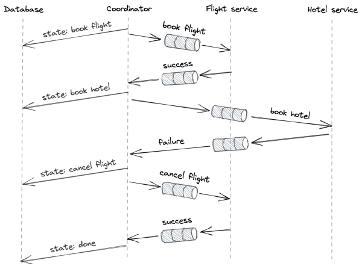

# **Chapter 13** 

# **Asynchronous transactions** 

2PC is a synchronous blocking protocol — if the coordinator or any of the participants is slow or not not available, the transaction can’t make progress. Because of its blocking nature, 2PC is generally combined with a blocking concurrency control protocol, like 2PL, to provide isolation. That means the participants are holding locks while waiting for the coordinator, blocking other transactions accessing the same objects from making progress. 

The underlying assumptions of 2PC are that the coordinator and the participants are available and that the duration of the transaction is short-lived. While we can do something about the participants’ availability by using state machine replication, we can’t do much about transactions that, due to their nature, take a long time to execute, like hours or days. In this case, blocking just isn’t an option. Additionally, if the participants belong to different organizations, the organizations might be unwilling to grant each other the power to block their systems to run transactions they don’t control. 

To solve this problem, we can look for solutions in the real world. For example, consider a fund transfer between two banks via a 

128 cashier’s check. First, the bank issuing the check deducts the funds from the source account. Then, the check is physically transported to the other bank and there it’s finally deposited to the destination account. For the fund transfer to work, the check cannot be lost or deposited more than once. Since neither the source nor destination bank had to wait on each other while the transaction was in progress, the fund transfer via check is an asynchronous (nonblocking) atomic transaction. However, the price to pay for this is that the source and destination account are in an inconsistent state while the check is being transferred. So although asynchronous transactions are atomic, they are not isolated from each other. 

Now, because a check is just a message, we can generalize this idea with the concept of _persistent_ messages sent over the network, i.e., messages that that are guaranteed to be processed _exactly once_ . In this chapter, we will discuss a few implementations of asynchrounous transactions based on this concept. 

# **13.1 Outbox pattern** 

A common pattern[1] in modern applications is to replicate the same data to different data stores tailored to different use cases. For example, suppose we own a product catalog service backed by a relational database, and we decide to offer an advanced full-text search capability in its API. Although some relational databases offer a basic full-text search functionality, a dedicated service such as Elasticsearch[2] is required for more advanced use cases. 

To integrate with the search service, the catalog service needs to update both the relational database and the search service when a new product is added, or an existing product is modified or deleted. The service could update the relational database first and then the search service, but if the service crashes before updating the search service, the system would be left in an inconsistent 

> 1“Online Event Processing: Achieving consistency where distributed transactions have failed,” https://queue.acm.org/detail.cfm?id=3321612 

> 2“Elasticsearch: A distributed, RESTful search and analytics engine,” https:// www.elastic.co/elasticsearch/ 

129 state. So we need to wrap the two updates into a transaction somehow. 

We could consider using 2PC, but while the relational database supports the X/Open XA[3] 2PC standard, the search service doesn’t, which means we would have to implement the protocol for the search service somehow. We also don’t want the catalog service to block if the search service is temporarily unavailable. Although we want the two data stores to be in sync, we can accept some temporary inconsistencies. So eventual consistency is acceptable for our use case. 

We can solve this problem by having the catalog service send a persistent message to the search service whenever a product is added, modified or deleted. One way of implementing that is for a local transaction to append the message to a dedicated _outbox_ table[4] when it makes a change to the product catalog. Because the relational database supports ACID transactions, the message is appended to the outbox table if and only if the local transaction commits and is not aborted. 

The outbox table can then be monitored by a dedicated _relay process_ . When the relay process discovers a new message, it sends the message to the destination, the search service. The relay process deletes the message from the table only when it receives an acknolowedgment that it was was delivered successfully. Unsurprisingly, it’s possible for the same message to be delivered multiple times. For example, if the relay process crashes after sending the message but before removing it from the table, it will resend the message when it restarts. To guarantee that the destination processes the message only once, an idempotency key is assigned to it so that the message can be deduplicated (we discussed this in chapter 5.7). 

In practice, the relay process doesn’t send messages directly to the 

> 3“Distributed Transaction Processing: The XA Specification,” https://pubs.ope ngroup.org/onlinepubs/009680699/toc.pdf 

> 4“Pattern: Transactional outbox,” https://microservices.io/patterns/data/tra nsactional-outbox.html 

130 destination. Instead, it forwards messages to a message channel[5] , like Kafka[6] or Azure Event Hubs[7] , responsible for delivering them to one or more destinations in the same order as they were appended. Later in chapter 23, we will discuss message channels in more detail. 

If you squint a little, you will see that what we have just implemented here is conceptually similar to state machine replication, where the state is represented by the products in the catalog, and the replication happens through a log of operations (the outbox table). 

# **13.2 Sagas** 

Now suppose we own a travel booking service. To book a trip, the travel service has to atomically book a flight through a dedicated service and a hotel through another. However, either of these services can fail their respective request. If one booking succeeds, but the other fails, then the former needs to be canceled to guarantee atomicity. Hence, booking a trip requires multiple steps to complete, some of which are only required in case of failure. For that reason, we can’t use the simple solution presented earlier. 

The _Saga_[8] pattern provides a solution to this problem. A saga is a distributed transaction composed of a set of local transactions 𝑇1, 𝑇2, ..., 𝑇𝑛, where 𝑇𝑖 has a corresponding compensating local transaction 𝐶𝑖 used to undo its changes. The saga guarantees that either all local transactions succeed, or, in case of failure, the compensating local transactions undo the partial execution of the transaction altogether. This guarantees the atomicity of the protocol; either all local transactions succeed, or none of them do. 

> 5For example, Debezium is an open source relay service that does this, see https: //debezium.io/. 

> 6“Apache Kafka: An open-source distributed event streaming platform,” https: //kafka.apache.org 

> 7“Azure Event Hubs: A fully managed, real-time data ingestion service,” https: //azure.microsoft.com/en-gb/services/event-hubs/ 8“Sagas,” https://www.cs.cornell.edu/andru/cs711/2002fa/reading/sagas. pdf 

131 

Another way to think about sagas is that every local transaction 𝑇𝑖 assumes all the other local transactions will succeed. It’s a guess, and it’s likely to be a good one, but still a guess at the end of the day. So when the guess is wrong, a mistake has been made, and an “apology[9] ” needs to be issued in the form of compensating transactions 𝐶𝑖. This is similar to what happens in the real world when, e.g., a flight is overbooked. 

A saga can be implemented with an orchestrator, i.e., the transaction coordinator, that manages the execution of the local transactions across the processes involved, i.e., the transaction’s participants. In our example, the travel booking service is the transaction’s coordinator, while the flight and hotel booking services are the transaction’s participants. The saga is composed of three local transactions: 𝑇1 books a flight, 𝑇2 books a hotel, and 𝐶1 cancels the flight booked with 𝑇1. 

At a high level, the saga can be implemented with the _workflow_[10] depicted in Figure 13.1: 

1. The coordinator initiates the transaction by sending a booking request (𝑇1) to the flight service. If the booking fails, no harm is done, and the coordinator marks the transaction as aborted. 

2. If the flight booking succeeds, the coordinator sends a booking request (𝑇2) to the hotel service. If the request succeeds, the transaction is marked as successful, and we are all done. 

3. If the hotel booking fails, the transaction needs to be aborted. The coordinator sends a cancellation request (𝐶1) to the flight service to cancel the previously booked flight. Without the cancellation, the transaction would be left in an inconsistent state, which would break its atomicity guarantee. 

The coordinator can communicate asynchronously with the participants via message channels to tolerate temporary failures. As the transaction requires multiple steps to succeed, and the coordinator 

> 9”Building on Quicksand,” https://dsf.berkeley.edu/cs286/papers/quicksan d-cidr2009.pdf 

> 10“Clarifying the Saga pattern,” http://web.archive.org/web/20161205130022 /http://kellabyte.com:80/2012/05/30/clarifying-the-saga-pattern 

132 can fail at any time, it needs to persist the state of the transaction as it advances. By modeling the transaction as a state machine, the coordinator can durably checkpoint its state to a data store as it transitions from one state to the next. This ensures that if the coordinator crashes and restarts, or another process is elected as the coordinator, it can resume the transaction from where it left off by reading the last checkpoint. 

Figure 13.1: A workflow implementing an asynchronous transaction 

There is a caveat, though; if the coordinator crashes after sending a request but before backing up its state, it will send the same request again when it comes back online. Similarly, if sending a request times out, the coordinator will have to retry it, causing the message to appear twice at the receiving end. Hence, the participants have to de-duplicate the messages they receive to make them idempotent. 

In practice, you don’t need to build orchestration engines from scratch to implement such workflows, since cloud compute ser133 vices such as AWS Step Functions[11] or Azure Durable Functions[12] make it easy to create managed workflows. 

# **13.3 Isolation** 

We started our journey into asynchronous transactions as a way to work around the blocking nature of 2PC. But to do that, we had to sacrifice the isolation guarantee that traditional ACID transactions provide. As it turns out, we can work around the lack of isolation as well. For example, one way to do that is by using _semantic locks_[13] . The idea is that any data the saga modifies is marked with a _dirty flag_ , which is only cleared at the end of the transaction. Another transaction trying to access a dirty record can either fail and roll back its changes or wait until the dirty flag is cleared. 

> 11“AWS Step Functions,” https://aws.amazon.com/step-functions/ 

> 12“Azure Durable Functions documentation ,” https://docs.microsoft.com/enus/azure/azure-functions/durable/ 

> 13“Semantic ACID properties in multidatabases using remote procedure calls and update propagations,” https://dl.acm.org/doi/10.5555/284472.284478 

# **Summary** 

If you pick any textbook about distributed systems or database systems, I guarantee you will find entire chapters dedicated to the topics discussed in this part. In fact, you can find entire books written about them! Although you could argue that it’s unlikely you will ever have to implement core distributed algorithms such as state machine replication from scratch, I feel it’s important to have seen these at least once as it will make you a better “user” of the abstractions they provide. 

There are two crucial insights I would like you to take away from this part. One is that failures are unavoidable in distributed systems, and the other is that coordination is expensive. 

By now, you should have realized that what makes the coordination algorithms we discussed so complex is that they must tolerate failures. Take Raft, for example. Imagine how much simpler the implementation would be if the network were reliable and processes couldn’t crash. If you were surprised by one or more edge cases in the design of Raft or chain replication, you are not alone. This stuff is hard! Fault tolerance plays a big role at any level of the stack, which is why I dedicated Part IV to it. 

The other important takeaway is that coordination adds complexity and impacts scalability and performance. Hence, you should strive to reduce coordination when possible by: 

- keeping coordination off the critical path, as chain replication does; 

136 

- proceeding without coordination and “apologize” when an inconsistency is detected, as sagas do; 

- using protocols that guarantee some form of consistency without coordination, like CRDTs. 

