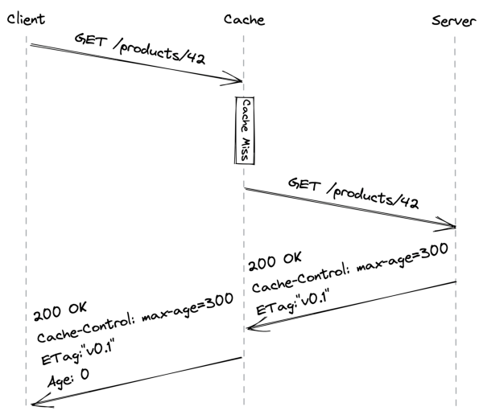
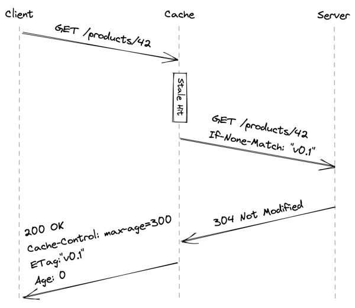
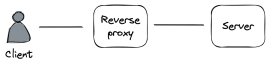

## **Chapter 14** 

## **HTTP caching** 

_Cruder_ ’s application server handles both static and dynamic resources at this point. A static resource contains data that usually doesn’t change from one request to another, like a JavaScript or CSS file. Instead, a dynamic resource is generated by the server on the fly, like a JSON document containing the user’s profile. 

Since a static resource doesn’t change often, it can be cached. The idea is to have a client (i.e., a browser) cache the resource for some time so that the next access doesn’t require a network call, reducing the load on the server and the response time.[1] 

Let’s see how client-side HTTP caching works in practice with a concrete example. HTTP caching is limited to safe request methods that don’t alter the server’s state, like GET or HEAD. Suppose a client issues a GET request for a resource it hasn’t accessed before. The local cache intercepts the request, and if it can’t find the resource locally, it will go and fetch it from the origin server on behalf of the client. 

The server uses specific HTTP response headers[2] to let clients know that a resource is cachable. So when the server responds 

> 1This is an example of the replication pattern in action. 

> 2“HTTP caching,” https://developer.mozilla.org/en-US/docs/Web/HTTP /Caching 

146 with the resource, it adds a _Cache-Control_ header that defines for how long to cache the resource (TTL) and an _ETag_ header with a version identifier. Finally, when the cache receives the response, it stores the resource locally and returns it to the client (see Figure 14.1). 

Figure 14.1: A client accessing a resource for the first time (the Age header contains the time in seconds the object was in the cache) 

Now, suppose some time passes and the client tries to access the resource again. The cache first checks whether the resource hasn’t expired yet, i.e., whether it’s _fresh_ . If so, the cache immediately returns it. However, even if the resource hasn’t expired from the client’s point of view, the server may have updated it in the meantime. That means reads are not strongly consistent, but we will safely assume that this is an acceptable tradeoff for our application. 

If the resource has expired, it’s considered _stale_ . In this case, the 

147 cache sends a GET request to the server with a conditional header (like _If-None-Match_ ) containing the version identifier of the stale resource to check whether a newer version is available. If there is, the server returns the updated resource; if not, the server replies with a _304 Not Modified_ status code (see Figure 14.2). 

Figure 14.2: A client accessing a stale resource 

Ideally, a static resource should be immutable so that clients can cache it “forever,” which corresponds to a maximum length of a year according to the HTTP specification. We can still modify a static resource if needed by creating a new one with a different URL so that clients will be forced to fetch it from the server. 

Another advantage of treating static resources as immutable is that we can update multiple related resources atomically. For example, if we publish a new version of the application’s website, the updated HTML index file is going to reference the new URLs for the JavaScript and CSS bundles. Thus, a client will see either the old 

148 version of the website or the new one depending on which index file it has read, but never a mix of the two that uses, e.g., the old JavaScript bundle with the new CSS one. 

Another way of thinking about HTTP caching is that we treat the read path ( _GET_ ) differently from the write path ( _POST, PUT, DELETE_ ) because we expect the number of reads to be several orders of magnitude higher than the number of writes. This is a common pattern referred to as the _Command Query Responsibility Segregation_[3] (CQRS) pattern.[4] 

To summarize, allowing clients to cache static resources has reduced the load on our server, and all we had to do was to play with some HTTP headers! We can take caching one step further by introducing a server-side HTTP cache with a reverse proxy. 

## **14.1 Reverse proxies** 

A _reverse proxy_ is a server-side proxy that intercepts all communications with clients. Since the proxy is indistinguishable from the actual server, clients are unaware that they are communicating through an intermediary (see Figure 14.3). 

Figure 14.3: A reverse proxy acts as an intermediary between the clients and the servers. 

A common use case for a reverse proxy is to cache static resources returned by the server. Since the cache is shared among the clients, it will decrease the load of the server a lot more than any client-side cache ever could. 

> 3“CQRS,” https://martinfowler.com/bliki/CQRS.html 

> 4This is another instance of functional decomposition. 

149 

Because a reverse proxy is a middleman, it can be used for much more than just caching. For example, it can: 

- authenticate requests on behalf of the server; 

- compress a response before returning it to the client to speed up the transmission; 

- rate-limit requests coming from specific IPs or users to protect the server from being overwhelmed; 

- load-balance requests across multiple servers to handle more load. 

We will explore some of these use cases in the next chapters. NGINX[5] and HAProxy[6] are widely-used reverse proxies that we could leverage to build a server-side cache. However, many use cases for reverse proxies have been commoditized by managed services. So, rather than building out a server-side cache, we could just leverage a _Content Delivery Network_ (CDN). 

> 6“HAProxy,” https://www.haproxy.com/ 

5“NGINX,” https://www.nginx.com/ 

