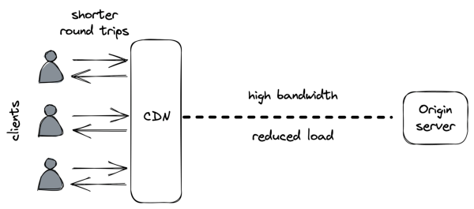

# **Chapter 15** 

# **Content delivery networks** 

A CDN is an overlay network of geographically distributed caching servers (reverse proxies) architected around the design limitations of the network protocols that run the internet. 

When using a CDN, clients hit URLs that resolve to caching servers that belong to the CDN. When a CDN server receives a request, it checks whether the requested resource is cached locally. If not, the CDN server transparently fetches it from the _origin server_ (i.e., our application server) using the original URL, caches the response locally, and returns it to the client. AWS CloudFront[1] and Akamai[2] are examples of well-known CDN services. 

# **15.1 Overlay network** 

You would think that the main benefit of a CDN is caching, but it’s actually the underlying network substrate. The public internet is composed of thousands of networks, and its core routing protocol, BGP, was not designed with performance in mind. It primarily 

> 1“Amazon CloudFront,” https://aws.amazon.com/cloudfront/ 

> 2“Akamai,” https://www.akamai.com/ 

152 uses the number of hops to cost how expensive a path is with respect to another, without considering their latencies or congestion. As the name implies, a CDN is a network. More specifically, an overlay network[3] built on top of the internet that exploits a variety of techniques to reduce the response time of network requests and increase the bandwidth of data transfers. 

When we first discussed TCP in chapter 2, we talked about the importance of minimizing the latency between a client and a server. No matter how fast the server is, if the client is located on the other side of the world from it, the response time is going to be over 100 ms just because of the network latency, which is physically limited by the speed of light. Not to mention the increased error rate when sending data across the public internet over long distances. 

This is why CDN clusters are placed in multiple geographical locations to be closer to clients. But how do clients know which cluster is closest to them? One way is via _global DNS load balancing_[4] : an extension to DNS that considers the location of the client inferred from its IP, and returns a list of the geographically closest clusters taking into account also the network congestion and the clusters’ health. 

CDN servers are also placed at _internet exchange points_ , where ISPs connect to each other. That way, virtually the entire communication from the origin server to the clients flows over network links that are part of the CDN, and the brief hops on either end have low latencies due to their short distance. 

The routing algorithms of the overlay network are optimized to select paths with reduced latencies and congestion, based on continuously updated data about the health of the network. Additionally, TCP optimizations are exploited where possible, such as using pools of persistent connections between servers 

> 3“The Akamai Network: A Platform for HighPerformance Internet Applications,” https://groups.cs.umass.edu/ramesh/wp-content/uploads/sites/3/ 2019/12/The-akamai-network-a-platform-for-high-performance-internetapplications.pdf 

> 4“Load Balancing at the Frontend,” https://landing.google.com/sre/srebook/chapters/load-balancing-frontend/ 

153 to avoid the overhead of setting up new connections and using optimal TCP window sizes to maximize the effective bandwidth (see Figure 15.1). 

Figure 15.1: A CDN reduces the round trip time of network calls for clients and the load for the origin server. 

The overlay network can also be used to speed up the delivery of dynamic resources that cannot be cached. In this capacity, the CDN becomes the frontend for the application, shielding it against distributed denial-of-service (DDoS) attacks[5] . 

# **15.2 Caching** 

A CDN can have multiple content caching layers. The top layer is made of edge clusters deployed at different geographical locations, as mentioned earlier. But infrequently accessed content might not be available at the edge, in which case the edge servers must fetch it from the origin server. Thanks to the overlay network, the content can be fetched more efficiently and reliably than what the public internet would allow. 

There is a tradeoff between the number of edge clusters and the cache _hit ratio_[6] , i.e., the likelihood of finding an object in the cache. 

> 5“Denial-of-service attack,” https://en.wikipedia.org/wiki/Denial-of-servic e_attack 

> 6A cache hit occurs when the requested data can be found in the cache, while a cache miss occurs when it cannot. 

154 

The higher the number of edge clusters, the more geographically dispersed clients they can serve, but the lower the cache hit ratio will be, and consequently, the higher the load on the origin server. To alleviate this issue, the CDN can have one or more intermediary caching clusters deployed in a smaller number of geographical locations, which cache a larger fraction of the original content. 

Within a CDN cluster, the content is partitioned among multiple servers so that each one serves only a specific subset of it; this is necessary as no single server would be able to hold all the data. Because data partitioning is a core scalability pattern, we will take a closer look at it in the next chapter. 

