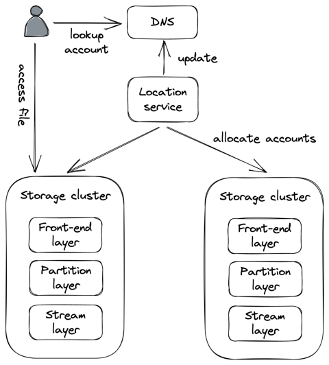
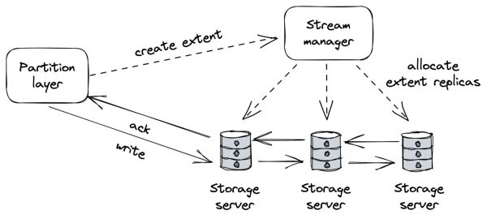
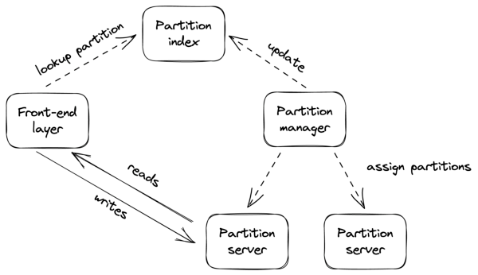

## **Chapter 17** 

## **File storage** 

Using a CDN has significantly reduced the number of requests hitting _Cruder_ ’s application server. But there are only so many images, videos, etc., the server can store on its local disk(s) before running out of space. To work around this limit, we can use a managed file store, like AWS S3[1] or Azure Blob Storage[2] , to store large static files. Managed file stores are scalable, highly available, and offer strong durability guarantees. A file uploaded to a managed store can be configured to allow access to anyone who knows its URL, which means we can point the CDN straight at it. This allows us to completely offload the storage and serving of static resources to managed services. 

## **17.1 Blob storage architecture** 

Because distributed file stores are such a crucial component of modern applications, it’s useful to have an idea of how they work underneath. In this chapter, we will dive into the architecture of 

> 1“Amazon Simple Storage Service,” https://aws.amazon.com/s3/ 

> 2“Azure Blob Storage,” https://azure.microsoft.com/en-us/services/storage/ blobs/#overview 

164 

Azure Storage[3] (AS), a scalable cloud storage system that provides strong consistency. AS supports file, queue, and table abstractions, but for simplicity, our discussion will focus exclusively on the file abstraction, also referred to as the blob store. 

AS is composed of storage clusters distributed across multiple regions worldwide. A _storage cluster_ is composed of multiple racks of nodes, where each rack is built out as a separate unit with redundant networking and power. 

At a high level, AS exposes a global namespace based on domain names that are composed of two parts: an account name and a file name. The two names together form a unique URL that points to a specific file, e.g., _https://ACCOUNT_NAME.blob.core.windows. net/FILE_NAME_ . The customer configures the account name, and the AS DNS server uses it to identify the storage cluster where the data is stored. The cluster uses the file name to locate the node responsible for the data. 

A central _location service_ acts as the global _control plane_ in charge of creating new accounts and allocating them to clusters, and also moving them from one cluster to another for better load distribution. For example, when a customer wants to create a new account in a specific region, the location service: 

- chooses a suitable cluster to which to allocate the account based on load information; 

- updates the configuration of the cluster to start accepting requests for the new account; 

- and creates a new DNS record that maps the account name to the cluster’s public IP address. 

From an architectural point of view, a storage cluster is composed of three layers: a stream layer, a partition layer, and a front-end layer (see Figure 17.1). 

The _stream layer_ implements a distributed append-only file system in which the data is stored in so-called streams. Internally, a _stream_ 

> 3“Windows Azure Storage: A Highly Available Cloud Storage Service with Strong Consistency,” https://sigops.org/s/conferences/sosp/2011/current /2011-Cascais/printable/11-calder.pdf 

165 

Figure 17.1: A high-level view of Azure Storage’s architecture is represented as a sequence of _extents_ , where the extent is the unit of replication. Writes to extents are replicated synchronously using chain replication[4] . 

The _stream manager_ is the control plane responsible for assigning an extent to a chain of storage servers in the cluster. When the manager is asked to allocate a new extent, it replies with the list of storage servers that hold a copy of the newly created extent (see Figure 17.2). The client caches this information and uses it to send future writes to the primary server. The stream manager is also responsible for handling unavailable or faulty extent replicas by creating new ones and reconfiguring the replication chains they are part of. 

The _partition layer_ is where high-level file operations are translated 

> 4we discussed chain replication in section 10.4 

166 

Figure 17.2: The stream layer uses chain replication to replicate extents across storage servers. to low-level stream operations. Within this layer, the _partition manager_ (yet another control plane) manages a large index of all files stored in the cluster. Each entry in the index contains metadata such as account and file name and a pointer to the actual data in the stream service (list of extent plus offset and length). The partition manager range-partitions the index and maps each partition to a partition server. The partition manager is also responsible for load-balancing partitions across servers, splitting partitions when they become too hot, and merging cold ones (see Figure 17.3). 

The partition layer also asynchronously replicates accounts across clusters in the background. This functionality is used to migrate accounts from one cluster to another for load-balancing purposes and disaster recovery. 

Finally, the _front-end service_ (a reverse proxy) is a stateless service that authenticates requests and routes them to the appropriate partition server using the mapping managed by the partition manager. 

Although we have only coarsely described the architecture of AS, it’s a great showcase of the scalability patterns applied to a concrete system. As an interesting historical note, AS was built from the ground up to be strongly consistent, while AWS S3 started of167 

Figure 17.3: The partition manager range-partitions files across partition servers and rebalances the partitions when necessary. fering the same guarantee in 2021[5] . 

> 5“Diving Deep on S3 Consistency,” https://www.allthingsdistributed.com/2 021/04/s3-strong-consistency.html 

