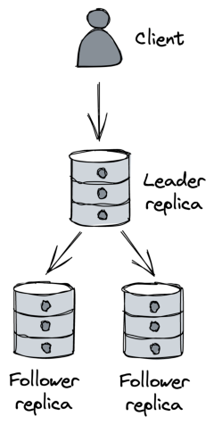

# **Chapter 19** 

# **Data storage** 

Because _Cruder_ is stateless, we were able to scale it out by running multiple application servers behind a load balancer. But as the application handles more load, the number of requests to the relational database increases as well. And since the database is hosted on a single machine, it’s only a matter of time until it reaches its capacity and it starts to degrade. 

# **19.1 Replication** 

We can increase the read capacity of the database by creating replicas. The most common way of doing that is with a leader-follower topology (see Figure 19.1). In this model, clients send writes (updates, inserts, and deletes) exclusively to the leader, which persists the changes to its write-ahead log. Then, the followers, or replicas, connect to the leader and stream log entries from it, committing them locally. Since log entries have a sequence number, followers can disconnect and reconnect at any time and start from where they left off by communicating to the leader the last sequence number they processed. 

By creating read-only followers and putting them behind a load balancer, we can increase the read capacity of the database. Repli182 

Figure 19.1: Single leader replication cation also increases the availability of the database. For example, the load balancer can automatically take a faulty replica out of the pool when it detects that it’s no longer healthy or available. And when the leader fails, a replica can be reconfigured to take its place. Additionally, individual followers can be used to isolate specific workloads, like expensive analytics queries that are run periodically, so that they don’t impact the leader and other replicas. 

The replication between the leader and the followers can happen either fully synchronously, fully asynchronously, or as a combination of the two. 

If the replication is _fully asynchronous_ , when the leader receives a write, it broadcasts it to the followers and immediately sends a response back to the client without waiting for the followers to acknowledge it. Although this approach minimizes the response time for the client, it’s not fault-tolerant. For example, the leader could crash right after acknowledging a write and before broad183 casting it to the followers, resulting in data loss. 

In contrast, if replication is _fully synchronous_ , the leader waits for the write to be acknowledged by the followers before returning a response to the client. This comes with a performance cost since a single slow replica increases the response time of every request. And if any replica is unreachable, the data store becomes unavailable. This approach is not scalable; the more followers there are, the more likely it is that at least one of them is slow or unavailable. 

In practice, relational databases often support a combination of synchronous and asynchronous replication. For example, in PostgreSQL, individual followers can be configured to receive updates synchronously[1] , rather than asynchronously, which is the default. So, for example, we could have a single synchronous follower whose purpose is to act as an up-to-date backup of the leader. That way, if the leader fails, we can fail over to the synchronous follower without incurring any data loss. 

Conceptually, the failover mechanism needs to: detect when the leader has failed, promote the synchronous follower to be the new leader and reconfigure the other replicas to follow it, and ensure client requests are sent to the new leader. Managed solutions like AWS RDS or Azure SQL Database, support read replicas[2] and automated failover[3] out of the box, among other features such as automated patching and backups. 

One caveat of replication is that it only helps to scale out reads, not writes. The other issue is that the entire database needs to fit on a single machine. Although we can work around that by moving some tables from the main database to others running on different nodes, we would only be delaying the inevitable. As you should know by now, we can overcome these limitations with partitioning. 

> 1“PostgreSQL Server Configuration, Replication,” https://www.postgresql.o rg/docs/14/runtime-config-replication.html 

> 2“Amazon RDS Read Replicas,” https://aws.amazon.com/rds/features/readreplicas/ 

> 3“Multi-AZ deployments for high availability,” https://docs.aws.amazon.co m/AmazonRDS/latest/UserGuide/Concepts.MultiAZ.html 

# **19.2 Partitioning** 

Partitioning allows us to scale out a database for both reads and writes. Even though traditional (centralized) relational databases generally don’t support it out of the box, we can implement it at the application layer in principle. However, implementing partitioning at the application layer is challenging and adds a lot of complexity to the system. For starters, we need to decide how to partition the data among the database instances and rebalance it when a partition becomes too hot or too big. Once the data is partitioned, queries that span multiple partitions need to be split into sub-queries and their responses have to be combined (think of aggregations or joins). Also, to support atomic transactions across partitions, we need to implement a distributed transaction protocol, like 2PC. Add to all that the requirement to combine partitioning with replication, and you can see how partitioning at the application layer becomes daunting. 

Taking a step back, the fundamental problem with traditional relational databases is that they have been designed under the assumption they fit on a single beefy machine. Because of that, they support a number of features that are hard to scale, like ACID transactions and joins. Relational databases were designed in an era where disk space was costly, and normalizing the data to reduce the footprint on disk was a priority, even if it came with a significant cost to unnormalize the data at query time with joins.[4] 

Times have changed, and storage is cheap nowadays, while CPU time isn’t. This is why, in the early 2000s, large tech companies began to build bespoke solutions for storing data designed from the ground up with high availability and scalability in mind. 

> 4That said, reducing storage costs isn’t the only benefit of normalization: it also helps maintain data integrity. If a piece of data is duplicated in multiple places, then to update it, we have to make sure it gets updated everywhere. In contrast, if the data is normalized, we only need to update it in one place. 

# **19.3 NoSQL** 

These early solutions didn’t support SQL and more generally only implemented a fraction of the features offered by traditional relational data stores. White papers such as Bigtable[5] and Dynamo[6] revolutionized the industry and started a push towards scalable storage layers, resulting in a plethora of open source solutions inspired by them, like HBase and Cassandra. 

Since the first generation of these data stores didn’t support SQL, they were referred to as _NoSQL_ . Nowadays, the designation is misleading as NoSQL stores have evolved to support features, like dialects of SQL, that used to be available only in relational data stores. 

While relational databases support stronger consistency models such as strict serializability, NoSQL stores embrace relaxed consistency models such as eventual and causal consistency to support high availability. 

Additionally, NoSQL stores generally don’t provide joins and rely on the data, often represented as key-value pairs or documents (e.g., JSON), to be unnormalized. A pure key-value store maps an opaque sequence of bytes (key) to an opaque sequence of bytes (value). A document store maps a key to a (possibly hierarchical) document without a strictly enforced schema. The main difference from a key-value store is that documents are interpreted and indexed and therefore can be queried based on their internal structure. 

Finally, since NoSQL stores natively support partitioning for scalability purposes, they have limited support for transactions. For example, Azure Cosmos DB currently only supports transactions scoped to individual partitions. On the other hand, since the data is stored in unnormalized form, there is less need for transactions or joins in the first place. 

> 5“Bigtable: A Distributed Storage System for Structured Data,” https://static .googleusercontent.com/media/research.google.com/en//archive/bigtableosdi06.pdf 

> 6we talked about Dynamo in section 11.3 

Although the data models used by NoSQL stores are generally not relational, we can still use them to model relational data. But if we take a NoSQL store and try to use it as a relational database, we will end up with the worst of both worlds. If used correctly, NoSQL can handle many of the use cases that a traditional relational database can[7] , while being essentially scalable from day 1.[8] 

The main requirement for using a NoSQL data store efficiently is to know the access patterns upfront and model the data accordingly; let’s see why that is so important. Take Amazon DynamoDB[9] , for example; its main abstraction is a table that contains items. Each item can have different attributes, but it must have a primary key that uniquely identifies an item. 

The primary key can consist of either a single attribute, the _partition key_ , or of two attributes, the _partition key_ and the _sort key_ . As you might suspect, the partition key dictates how the data is partitioned and distributed across nodes, while the sort key defines how the data is sorted within a partition, which allows for efficient range queries. 

DynamoDB creates three replicas for each partition and uses state machine replication to keep them in sync[10] . Writes are routed to the leader, and an acknowledgment is sent to the client when two out of three replicas have received the write. Reads can be either eventually consistent (pick any replica) or strongly consistent (query the leader). Confusingly enough, the architecture of DynamoDB is very different from the one presented in the Dynamo paper, which we discussed in chapter 11.3. 

At a high level, DynamoDB’s API supports: 

- CRUD operations on single items, 

> 7“AWS re:Invent 2018: Amazon DynamoDB Deep Dive: Advanced Design Patterns for DynamoDB (DAT401),” https://www.youtube.com/watch?v=HaEPX oXVf2k 

> 8 On the other hand, while we certainly can find ways to scale a relational database, what works on day 1 might not work on day 10 or 100. 

> 9“Amazon DynamoDB,” https://aws.amazon.com/dynamodb/ 

> 10“AWS re:Invent 2018: Amazon DynamoDB Under the Hood: How We Built a Hyper-Scale Database (DAT321),” https://www.youtube.com/watch?v=yvBR7 1D0nAQ 

- querying multiple items that have the same partition key (optionally specifying conditions on the sort key), 

- and scanning the entire table. 

There are no join operations, by design, since they don’t scale well. But that doesn’t mean we should implement joins in the application. Instead, as we will see shortly, we should model our data so that joins aren’t needed in the first place. 

The partition and sort key attributes are used to model the table’s access patterns. For example, suppose the most common access pattern is retrieving the list of orders for a specific customer sorted by date. In that case, it would make sense for the table to have the customer ID as the partition key, and the order creation date as the sort key: 

|Partition Key|Sort Key|Attribute|Attribute|
|---|---|---|---|
|jonsnow|2021-07-13|OrderID: 1452|Status: Shipped|
|aryastark|2021-07-20|OrderID: 5252|Status: Placed|
|branstark|2021-07-22|OrderID: 5260|Status: Placed|

Now suppose that we also want the full name of the customer in the list of orders. While, in a relational database, a table contains only entities of a certain type (e.g., customer), in NoSQL, a table can contain entities of multiple types. Thus, we could store both customers and orders within the same table: 

|Partition Key|Sort Key|Attribute|Attribute|
|---|---|---|---|
|jonsnow|2021-07-13|OrderID: 1452|Status: Shipped|
|jonsnow|jonsnow|FullName: Jon Snow|Address: …|
|aryastark|2021-07-20|OrderID: 5252|Status: Placed|
|aryastark|aryastark|FullName: Arya Stark|Address: …|

Because a customer and its orders have the same partition key, we can now issue a single query that retrieves all entities for the desired customer. 

See what we just did? We have structured the table based on the access patterns so that queries won’t require any joins. Now think for a moment about how you would model the same data in normalized form in a relational database. You would probably have one table for orders and another for customers. And, to perform the same query, a join would be required at query time, which would be slower and harder to scale. 

The previous example is very simple, and DynamoDB supports secondary indexes to model more complex access patterns — local secondary indexes allow for alternate sort keys in the same table, while global secondary indexes allow for different partition and sort keys, with the caveat that index updates are asynchronous and eventually consistent. 

It’s a common misconception that NoSQL data stores are more flexible than relational databases because they can seamlessly scale without modeling the data upfront. Nothing is further from the truth — NoSQL requires a lot more attention to how the data is modeled. Because NoSQL stores are tightly coupled to the access patterns, they are a lot less flexible than relational databases. 

If there is one concept you should take away from this chapter, it’s this: using a NoSQL data store requires identifying the access patterns upfront to model the data accordingly. If you want to learn how to do that, I recommend reading “The DynamoDB Book”[11] , even if you plan to use a different NoSQL store. 

As scalable data stores keep evolving, the latest trend is to combine the scalability of NoSQL with the ACID guarantees of relational databases. These new data stores are also referred to as NewSQL[12] . While NoSQL data stores prioritize availability over consistency in the face of network partitions, NewSQL stores prefer consistency. The argument behind NewSQL stores is that, with the right design, the reduction in availability caused by enforcing strong con- 

> 11“The DynamoDB Book,” https://www.dynamodbbook.com/ 

> 12“Andy Pavlo — The official ten-year retrospective of NewSQL databases,” ht tps://www.youtube.com/watch?v=LwkS82zs65g sistency is hardly noticeable[13] for many applications. That, combined with the fact that perfect 100% availability is not possible anyway (availability is defined in 9s), has spurred the drive to build storage systems that can scale but favor consistency over availability in the presence of network partitions. CockroachDB[14] and Spanner[15] are well-known examples of NewSQL data stores. 

> 13“NewSQL database systems are failing to guarantee consistency, and I blame Spanner,” https://dbmsmusings.blogspot.com/2018/09/newsql-databasesystems-are-failing-to.html 

> 14“CockroachDB,” https://github.com/cockroachdb/cockroach 

> 15we talked about Spanner in section 12.4 

