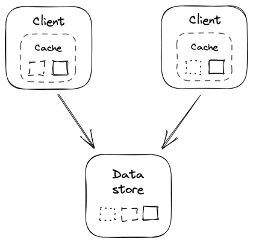
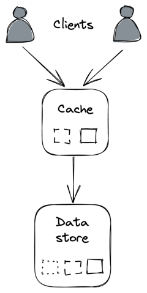

# **Chapter 20** 

# **Caching** 

Suppose a significant fraction of requests that _Cruder_ sends to its data store consists of a small pool of frequently accessed entries. In that case, we can improve the application’s performance and reduce the load on the data store by introducing a cache. A _cache_ is a high-speed storage layer that temporarily buffers responses from an _origin_ , like a data store, so that future requests can be served directly from it. It only provides best-effort guarantees, since its state is disposable and can be rebuilt from the origin. We have already seen some applications of caching when discussing the DNS protocol or CDNs. 

For a cache to be cost-effective, the proportion of requests that can be served directly from it (hit ratio) should be high. The _hit ratio_ depends on several factors, such as the universe of cachable objects (the fewer, the better), the likelihood of accessing the same objects repeatedly (the higher, the better), and the size of the cache (the larger, the better). 

As a general rule of thumb, the higher up in the call stack caching is used, the more resources can be saved downstream. This is why the first use case for caching we discussed was client-side HTTP caching. However, it’s worth pointing out that caching is an optimization, and you don’t have a scalable architecture if the origin, e.g., the data store in our case, can’t withstand the load without the cache fronting it. If the access pattern suddenly changes, leading to cache misses, or the cache becomes unavailable, you don’t want your application to fall over (but it’s okay for it to become slower). 

# **20.1 Policies** 

When a cache miss occurs, the missing object has to be requested from the origin, which can happen in two ways: 

- After getting an “object-not-found” error from the cache, the application requests the object from the origin and updates the cache. In this case, the cache is referred to as a _side cache_ , and it’s typically treated as a key-value store by the application. 

- Alternatively, the cache is _inline_ , and it communicates directly with the origin, requesting the missing object on behalf of the application. In this case, the application only ever accesses the cache. We have already seen an example of an inline cache when discussing HTTP caching. 

Because a cache has a limited capacity, one or more entries need to be evicted to make room for new ones when its capacity is reached. Which entry to remove depends on the eviction policy used by the cache and the objects’ access pattern. For example, one commonly used policy is to evict the _least recently used_ (LRU) entry. 

A cache can also have an _expiration policy_ that dictates when an object should be evicted, e.g., a TTL. When an object has been in the cache for longer than its TTL, it expires and can safely be evicted. The longer the expiration time, the higher the hit ratio, but also the higher the likelihood of serving stale and inconsistent data. 

The expiration doesn’t need to occur immediately, and it can be deferred to the next time the entry is requested. In fact, that might be preferable — if the origin (e.g., a data store) is temporarily unavailable, it’s more resilient to return an object with an expired TTL to the application rather than an error. 

An expiry policy based on TTL is a workaround for _cache invalidation_ , which is very hard to implement in practice[1] . For example, if you were to cache the result of a database query, every time any of the data touched by that query changes (which could span thousands of records or more), the cached result would need to be invalidated somehow. 

# **20.2 Local cache** 

The simplest way to implement a cache is to co-locate it with the client. For example, the client could use a simple in-memory hash table or an embeddable key-value store, like RocksDB[2] , to cache responses (see Figure 20.1). 

Figure 20.1: In-process cache 

Because each client cache is independent of the others, the same objects are duplicated across caches, wasting resources. For example, if every client has a local cache of 1GB, then no matter how many clients there are, the total size of the cache is 1 GB. Also, consistency issues will inevitably arise; for example, two clients might see different versions of the same object.

> 1“Cache coherence,” https://en.wikipedia.org/wiki/Cache_coherence 

> 2“RocksDB,” http://rocksdb.org/

Additionally, as the number of clients grows, the number of requests to the origin increases. This issue is exacerbated when clients restart, or new ones come online, and their caches need to be populated from scratch. This can cause a “thundering herd” effect where the downstream origin is hit with a spike of requests. The same can also happen when a specific object that wasn’t accessed before becomes popular all of a sudden. 

Clients can reduce the impact of a thundering herd by _coalescing_ requests for the same object. The idea is that, at any given time, there should be at most one outstanding request per client to fetch a specific object. 

# **20.3 External cache** 

An external cache is a service dedicated to caching objects, typically in memory. Because it’s shared across clients, it addresses some of the drawbacks of local caches at the expense of greater complexity and cost (see Figure 20.2). For example, Redis[3] or Memcached[4] are popular caching services, also available as managed services on AWS and Azure. 

Unlike a local cache, an external cache can increase its throughput and size using replication and partitioning. For example, Redis[5] can automatically partition data across multiple nodes and replicate each partition using a leader-follower protocol. 

Since the cache is shared among its clients, there is only a single version of each object at any given time (assuming the cache is not replicated), which reduces consistency issues. Also, the number of times an object is requested from the origin doesn’t grow with the number of clients. 

> 3“Redis,” https://redis.io/ 

> 4“Memcached,” https://memcached.org/ 

> 5“Redis cluster tutorial,” https://redis.io/topics/cluster-tutorial 

Figure 20.2: Out-of-process cache 

Although an external cache decouples clients from the origin, the load merely shifts to the external cache. Therefore, the cache will eventually need to be scaled out if the load increases. When that happens, as little data as possible should be moved around (or dropped) to avoid the cache degrading or the hit ratio dropping significantly. Consistent hashing, or a similar partitioning technique, can help reduce the amount of data that needs to be shuffled when the cache is rebalanced. 

An external cache also comes with a maintenance cost as it’s yet another service that needs to be operated. Additionally, the latency to access it is higher than accessing a local cache because a network call is required. 

If the external cache is down, how should the clients react? You would think it might be okay to bypass the cache and directly hit the origin temporarily. But the origin might not be prepared to withstand a sudden surge of traffic. Consequently, the external cache becoming unavailable could cause a cascading failure, resulting in the origin becoming unavailable as well. 

To avoid that, clients could use an in-process cache as a defense against the external cache becoming unavailable. That said, the origin also needs to be prepared to handle these sudden “attacks” by, e.g., shedding requests; we will discuss a few approaches for achieving that in the book’s resiliency part. What’s important to remember is that caching is an optimization, and the system needs to survive without it at the cost of being slower. 

