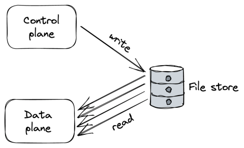
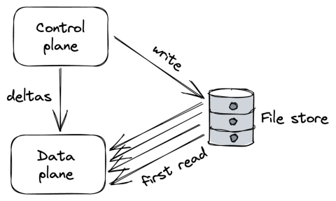

## **Chapter 22** 

## **Control planes and data planes** 

The API gateway is a single point of failure. If it goes down, then so does _Cruder_ , which is why it needs to be highly available. And because every external request needs to go through it, it must also be scalable. This creates some interesting challenges with regard to external dependencies. 

For example, suppose the gateway has a specific “configuration” or management endpoint to add, remove and configure API keys used to rate-limit requests. Unsurprisingly, the request volume for the configuration endpoint is a lot lower than the one for the main endpoint(s), and a lower scale would suffice to handle it. And while the gateway needs to prefer availability and performance over consistency for routing external requests to internal services, it should prefer consistency over availability for requests sent to the management endpoint. 

Because of these different and competing requirements, we could split the API gateway into a _data plane_ service that serves external requests directed towards our internal services and a _control plane_ service that manages the gateway’s metadata and configuration. 

210 

As it turns out, this split is a common pattern[1] . For example, in chain replication in section 10.4, the control plane holds the configuration of the chains. And in Azure Storage, which we discussed in chapter 17, the stream and partition managers are control planes that manage the allocation of streams and partitions to storage and partition servers, respectively. 

More generally, a data plane includes any functionality on the critical path that needs to run for each client request. Therefore, it must be highly available, fast, and scale with the number of requests. In contrast, a control plane is not on the critical path and has less strict scaling requirements. Its main job is to help the data plane do its work by managing metadata or configuration and coordinating complex and infrequent operations. And since it generally needs to offer a consistent view of its state to the data plane, it favors consistency over availability. 

An application can have multiple independent control and data planes. For example, a control plane might be in charge of scaling a service up or down based on load, while another manages its configuration. 

But separating the control plane from the data plane introduces complexity. The data plane needs to be designed to withstand control plane failures for the separation to be robust. If the data plane stops serving requests when the control plane becomes unavailable, we say the former has a _hard dependency_ on the latter. Intuitively, the entire system becomes unavailable if either the control plane or the data plane fails. More formally, when we have a chain of components that depend on each other, the theoretical availability of the system is the product of the availabilities of its components. 

For example, if the data plane has a theoretical availability of 99.99%, but the control plane has an availability of 99%, then the overall system can only achieve a combined availability of 98.99%: 

> 1“Control Planes vs Data Planes,” https://brooker.co.za/blog/2019/03/17/co ntrol.html 

211 

## 0.9999 ⋅0.99 = 0.9899 

In other words, a system can at best be only as available as its least available hard dependency. We can try to make the control plane more reliable, but more importantly, we should ensure that the data plane can withstand control plane failures. If the control plane is temporarily unavailable, the data plane should continue to run with a stale configuration rather than stop. This concept is also referred to as _static stability_ . 

## **22.1 Scale imbalance** 

Generally, data planes and control planes tend to have very different scale requirements. This creates a risk as the data plane can overload[2] the control plane. 

Suppose the control plane exposes an API that the data plane periodically queries to retrieve the latest configuration. Under normal circumstances, you would expect the requests to the control plane to be spread out in time more or less uniformly. But, in some cases, they can cluster within a short time interval. For example, if, for whatever reason, the processes that make up the data plane are restarted at the same time and must retrieve the configuration from the control plane, they could overload it. 

Although the control plane can defend itself to some degree with the resiliency mechanisms described in chapter 28, eventually, it will start to degrade. If the control plane becomes unavailable because of overload or any other reason (like a network partition), it can take down the data plane with it. 

Going back to the previous example, if part of the data plane is trying to start but can’t reach the control plane because it’s overloaded, it won’t be able to come online. So how can we design around that? 

> 2“Avoiding overload in distributed systems by putting the smaller service in control,” https://aws.amazon.com/builders-library/avoiding-overload-indistributed-systems-by-putting-the-smaller-service-in-control/ 

212 

One way is to use a scalable file store, like Azure Storage or S3, as a buffer between the control plane and the data plane. The control plane periodically dumps its entire state to the file store regardless of whether it changed, while the data plane reads the state periodically from it (see Figure 22.1). Although this approach sounds naive and expensive, it tends to be reliable and robust in practice. And, depending on the size of the state, it might be cheap too.[3] 

Figure 22.1: The intermediate data store protects the control plane by absorbing the load generated by the data plane. 

Introducing an intermediate store as a buffer decouples the control plane from the data plane and protects the former from overload. It also enables the data plane to continue to operate (or start) if the control plane becomes unavailable. But this comes at the cost of higher latencies and weaker consistency guarantees, since the time it takes to propagate changes from the control plane to the data plane will necessarily increase. 

To decrease the propagation latency, a different architecture is needed in which there is no intermediary. The idea is to have the data plane connect to the control plane, like in our original approach, but have the control plane push the configuration whenever it changes, rather than being at the mercy of periodic queries from the data plane. Because the control plane controls the pace, it will slow down rather than fall over when it can’t keep 

3This is another example of the CQRS pattern applied in practice. 

213 up.[4] 

To further reduce latencies and load, the control plane can version changes and push only updates/deltas to the data plane. Although this approach is more complex to implement, it significantly reduces the propagation time when the state is very large. 

However, the control plane could still get hammered if many data plane instances start up around the same time (due to a massive scale-out or restart) and try to read the entire configuration from the control plane for the first time. To defend against this, we can reintroduce an intermediate data store that contains a recent snapshot of the control plane’s state. This allows the data plane to read a snapshot from the store at startup and then request only a small delta from the control plane (see Figure 22.2). 

Figure 22.2: The intermediate data store absorbs the load of bulk reads, while the control plane pushes small deltas to the data plane whenever the state changes. 

> 4That said, there is still the potential to overload the control plane if it needs to juggle too many connections. 

214 

## **22.2 Control theory** 

Control theory gives us another[5] way to think about control planes and data planes. In control theory, the goal is to create a controller that monitors a dynamic system, compares its state to the desired one, and applies a corrective action to drive the system closer to it while minimizing any instabilities on the way. 

In our case, the data plane is the dynamic system we would like to drive to the desired state, while the controller is the control plane responsible for _monitoring_ the data plane, _comparing_ it to the desired state, and executing a corrective _action_ if needed. 

The control plane and the data plane are part of a feedback loop. And without all three ingredients ( _monitor_ , _compare_ , and _action_ ), you don’t have a closed loop, and the data plane can’t reach the desired state[6] . The monitoring part is the most commonly missing ingredient to achieve a closed loop. 

Take chain replication, for example. The control plane’s job shouldn’t be just to push the configuration of the chains to the data plane. It should also monitor whether the data plane has actually applied the configuration within a reasonable time. If it hasn’t, it should perform some corrective action, which could be as naive as rebooting nodes with stale configurations or excluding them from being part of any chain. 

A more mundane example of a control plane is a CI/CD pipeline for releasing a new version of a service without causing any disruption. One way to implement the pipeline is to deploy and release a new build blindly without monitoring the running service — the build might throw an exception at startup that prevents the service from starting, resulting in a catastrophic failure. Instead, the pipeline should release the new build incrementally while monitoring the service and stop the roll-out if there is clear evidence that 

> 5“AWS re:Invent 2018: Close Loops & Opening Minds: How to Take Control of Systems, Big & Small ARC337,” https://www.youtube.com/watch?v=O8xLxNj e30M 

> 6That said, having a closed loop doesn’t guarantee that either, it’s merely a prerequisite. 

215 something is off, and potentially also roll it back automatically. To sum up, when dealing with a control plane, ask yourself what’s missing to close the loop. We have barely scratched the surface of the topic, and if you want to learn more about it, “Designing Distributed Control Systems”[7] is a great read. 

7“Designing Distributed Control Systems,” https://www.amazon.com/gp/pr oduct/1118694155 

