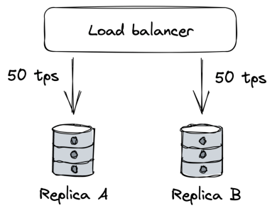
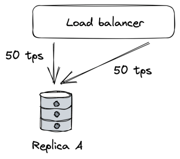
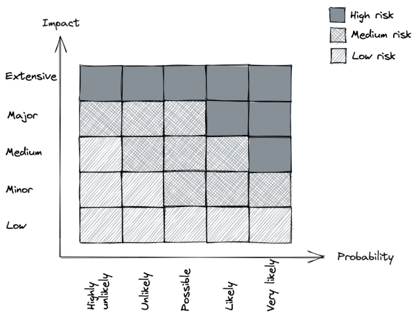

## **Chapter 24** 

## **Common failure causes** 

We say that a system has a _failure_[1] when it no longer provides a service to its users that meets its specification. A failure is caused by a _fault_ : a failure of an internal component or an external dependency the system depends on. Some faults can be tolerated and have no user-visible impact at all, while others lead to failures. 

To build fault-tolerant applications, we first need to have an idea of what can go wrong. In the next few sections, we will explore some of the most common root causes of failures. By the end of it, you will likely wonder how to tolerate all these different types of faults. The answers will follow in the next few chapters. 

## **24.1 Hardware faults** 

Any physical part of a machine can fail. HDDs, memory modules, power supplies, motherboards, SSDs, NICs, or CPUs, can all stop working for various reasons. In some cases, hardware faults can cause data corruption as well. If that wasn’t enough, entire data centers can go down because of power cuts or natural disasters. 

> 1“A Conceptual Framework for System Fault Tolerance,” https://resources.sei. cmu.edu/asset_files/TechnicalReport/1992_005_001_16112.pdf 

234 

As we will discuss later, we can address many of these infrastructure faults with redundancy. You would think that these faults are the main cause for distributed applications failing, but in reality, they often fail for very mundane reasons. 

## **24.2 Incorrect error handling** 

A study from 2014[2] of user-reported failures from five popular distributed data stores found that the majority of catastrophic failures were the result of incorrect handling of non-fatal errors. 

In most cases, the bugs in the error handling could have been detected with simple tests. For example, some handlers completely ignored errors. Others caught an overly generic exception, like _Exception_ in Java, and aborted the entire process for no good reason. And some other handlers were only partially implemented and even contained “FIXME” and “TODO” comments. 

In hindsight, this is perhaps not too surprising, given that error handling tends to be an afterthought.[3] Later, in chapter 29, we will take a closer look at best practices for testing large distributed applications. 

## **24.3 Configuration changes** 

Configuration changes are one of the leading root causes for catastrophic failures[4] . It’s not just misconfigurations that cause problems, but also valid configuration changes to enable rarely-used features that no longer work as expected (or never did). 

What makes configuration changes particularly dangerous is that their effects can be delayed[5] . If an application reads a configura- 

> 2“Simple Testing Can Prevent Most Critical Failures: An Analysis of Production Failures in Distributed Data-Intensive Systems,” https://www.usenix.org/syste m/files/conference/osdi14/osdi14-paper-yuan.pdf 

> 3This is the reason the Go language puts so much emphasis on error handling. 

> 4“A List of Post-mortems: Config Errors,” https://github.com/danluu/postmortems#config-errors 

> 5“Early Detection of Configuration Errors to Reduce Failure Damage,” https: //www.usenix.org/system/files/conference/osdi16/osdi16-xu.pdf 

235 tion value only when it’s actually needed, an invalid value might take effect only hours or days after it has changed and thus escape early detection. 

This is why configuration changes should be version-controlled, tested, and released just like code changes, and their validation should happen preventively when the change happens. In chapter 30, we will discuss safe release practices for code and configuration changes in the context of continuous deployments. 

## **24.4 Single points of failure** 

A single point of failure (SPOF) is a component whose failure brings the entire system down with it. In practice, systems can have multiple SPOFs. 

Humans make for great SPOFs, and if you put them in a position where they can cause a catastrophic failure on their own, you can bet they eventually will. For example, human failures often happen when someone needs to manually execute a series of operational steps in a specific order without making any mistakes. On the other hand, computers are great at executing instructions, which is why automation should be leveraged whenever possible. 

Another common SPOF is DNS[6] . If clients can’t resolve the domain name for an application, they won’t be able to connect to it. There are many reasons why that can happen, ranging from domain names expiring[7] to entire root level domains going down[8] . 

Similarly, the TLS certificate used by an application for its HTTP endpoints is also a SPOF[9] . If the certificate expires, clients won’t be able to open a secure connection with the application. 

> 6“It’s always DNS,” https://twitter.com/ahidalgosre/status/1315345619926 609920?lang=en-GB 

> 7“Foursquare Goes Dark Too. Unintentionally.,” https://techcrunch.com/201 0/03/27/foursquare-offline 

> 8“Stop using .IO Domain Names for Production Traffic,” https://hackernoon.c om/stop-using-io-domain-names-for-production-traffic-b6aa17eeac20 

> 9“Microsoft Teams goes down after Microsoft forgot to renew a certificate,” ht tps://www.theverge.com/2020/2/3/21120248/microsoft-teams-down-outagecertificate-issue-status 

236 

Ideally, SPOFs should be identified when the system is designed. The best way to detect them is to examine every system component and ask what would happen if it were to fail. Some SPOFs can be architected away, e.g., by introducing redundancy, while others can’t. In that case, the only option left is to reduce the SPOF’s blast radius, i.e., the damage the SPOF inflicts on the system when it fails. Many of the resiliency patterns we will discuss later reduce the blast radius of failures. 

## **24.5 Network faults** 

When a client sends a request to a server, it expects to receive a response from it a while later. In the best case, it receives the response shortly after sending the request. If that doesn’t happen, the client has two options: continue to wait or fail the request with a time-out exception or error. As discussed in chapter 7, when the concepts of failure detection and timeouts were introduced, there are many reasons for not getting a prompt response. For example, the server could be very slow or have crashed while processing the request; or maybe the network could be losing a small percentage of packets, causing lots of retransmissions and delays. 

Slow network calls are the silent killers[10] of distributed systems. Because the client doesn’t know whether the response will eventually arrive, it can spend a long time waiting before giving up, if it gives up at all, causing performance degradations that are challenging to debug. This kind of fault is also referred to as a _gray failure_[11] : a failure that is so subtle that it can’t be detected quickly or accurately. Because of their nature, gray failures can easily bring an entire system down to its knees. 

In the next section, we will explore another common cause of gray failures. 

> 10“Fallacies of distributed computing,” https://en.wikipedia.org/wiki/Fallacie s_of_distributed_computing 

> 11“Gray Failure: The Achilles’ Heel of Cloud-Scale Systems,” https://www.mi crosoft.com/en-us/research/wp-content/uploads/2017/06/paper-1.pdf 

237 

## **24.6 Resource leaks** 

From an observer’s point of view, a very slow process is not very different from one that isn’t running at all — neither can perform useful work. Resource leaks are one of the most common causes of slow processes. 

Memory is arguably the most well-known resource affected by leaks. A memory leak causes a steady increase in memory consumption over time. Even languages with garbage collection are vulnerable to leaks: if a reference to an object that is no longer needed is kept somewhere, the garbage collector won’t be able to delete it. When a leak has consumed so much memory that there is very little left, the operating system will start to swap memory pages to disk aggressively. Also, the garbage collector will kick in more frequently, trying to release memory. All of this consumes CPU cycles and makes the process slower. Eventually, when there is no more physical memory left, and there is no more space in the swap file, the process won’t be able to allocate memory, and most operations will fail. 

Memory is just one of the many resources that can leak. Take thread pools, for example: if a thread acquired from a pool makes a synchronous blocking HTTP call without a timeout and the call never returns, the thread won’t be returned to the pool. And since the pool has a limited maximum size, it will eventually run out of threads if it keeps losing them. 

You might think that making _asynchronous_ calls rather than synchronous ones would help in the previous case. However, modern HTTP clients use socket pools to avoid recreating TCP connections and paying a performance fee, as discussed in chapter 2. If a request is made without a timeout, the connection is never returned to the pool. As the pool has a limited maximum size, eventually, there won’t be any connections left. 

On top of that, your code isn’t the only thing accessing memory, threads, and sockets. The libraries your application depends on use the same resources, and they can hit the same issues we just 

238 discussed. 

## **24.7 Load pressure** 

Every system has a limit of how much load it can withstand, i.e., its capacity. So when the load directed to the system continues to increase, it’s bound to hit that limit sooner or later. But an organic increase in load, that gives the system the time to scale out accordingly and increase its capacity, is one thing, and a sudden and unexpected flood is another. 

For example, consider the number of requests received by an application in a period of time. The rate and the type of incoming requests can change over time, and sometimes suddenly, for a variety of reasons: 

- The requests might have a seasonality. So, for example, depending on the hour of the day, the application is hit by users in different countries. 

- Some requests are much more expensive than others and abuse the system in unexpected ways, like scrapers slurping in data at super-human speed. 

- Some requests are malicious, like those of DDoS attacks that try to saturate the application’s bandwidth to deny legitimate users access to it. 

While some load surges can be handled by automation that adds capacity (e.g., autoscaling), others require the system to reject requests to shield it from overloading, using the patterns we will discuss in chapter 28. 

## **24.8 Cascading failures** 

You would think that if a system has hundreds of processes, it shouldn’t make much of a difference if a small percentage are slow or unreachable. The thing about faults is that they have the potential to spread virally and cascade from one process to the other until the whole system crumbles to its knees. This happens when 

239 system components depend on each other, and a failure in one increases the probability of failure in others. 

For example, suppose multiple clients are querying two database replicas, A and B, behind a load balancer. Each replica handles about 50 transactions per second (see Figure 24.1). 

Figure 24.1: Two replicas behind a load balancer; each is handling half the load. 

Suddenly, replica B becomes unavailable because of a network fault. The load balancer detects that B is unavailable and removes it from the pool. Because of that, replica A has to pick up the slack for B and serve twice the requests per unit time it was serving before (see Figure 24.2). 

If replica A struggles to keep up with the incoming requests, the clients will experience increasingly more timeouts and start to retry requests, adding more load to the system. Eventually, replica A will be under so much load that most requests will time out, forcing the load balancer to remove it from the pool. In other words, the original network fault that caused replica B to become unavailable cascaded into a fault at replica A. 

Suppose now that replica B becomes available again and the load balancer puts it back in the pool. Because it’s the only replica in the pool, it will be flooded with requests, causing it to overload and eventually be removed again. 

240 

Figure 24.2: When replica B becomes unavailable, A will be hit with more load, which can strain it beyond its capacity. 

You can see how even after the network fault is gone, the application continues to struggle because of a feedback loop that causes the load to jump from one replica to another. Failures with this characteristic are also referred to as metastable[12] . 

A big enough corrective action is usually needed to break the loop, like temporarily blocking traffic from getting to the replicas in the first place. Unfortunately, these failures are very hard to mitigate once they have started, and the best way to prevent them is to stop faults from spreading from one component to another in the first place. 

## **24.9 Managing risk** 

As it should be evident by now, a distributed application needs to accept that faults are inevitable and be prepared to detect, react to, and repair them as they occur. 

At this point, you might feel overwhelmed by the sheer amount of things that can go wrong. But just because a specific fault has 

> 12“Metastable Failures in Distributed Systems,” https://sigops.org/s/confere nces/hotos/2021/papers/hotos21-s11-bronson.pdf 

241 a chance of happening, it doesn’t mean we have to do something about it. We first have to consider the probability it will manifest and the impact it will cause to the system’s users when it does. By multiplying the two factors together, we get a risk score[13] that we can use to prioritize which faults to address (see Figure 24.3) first. For example, a fault that is very likely to happen, and has a large impact, should be tackled head on; on the other hand, a fault with a low likelihood and low impact can wait. 

Figure 24.3: Risk matrix 

Once we decide that we need to do something about a specific fault, we can try to reduce its probability and/or reduce its impact. This will be the main focus of the next chapters. 

> 13“Risk matrix,” https://en.wikipedia.org/wiki/Risk_matrix 

