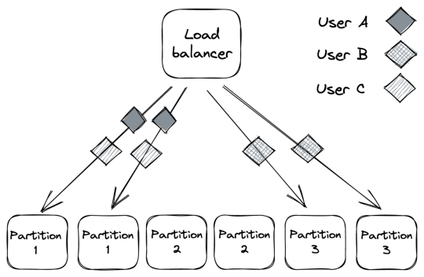
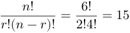
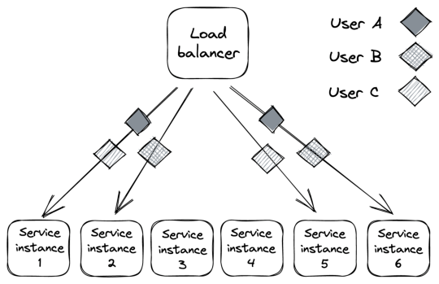
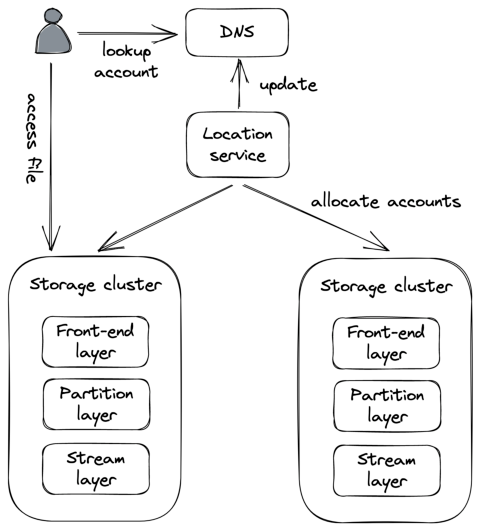

# **Chapter 26** 

# **Fault isolation** 

So far, we have discussed how to address infrastructure faults with redundancy, but there are other kinds of failures that we can’t tolerate with redundancy alone because of their high degree of correlation. 

For example, suppose a specific user sends malformed requests (deliberately or not) that cause the servers handling them to crash because of a bug. Since the bug is in the code, it doesn’t matter how many DCs and regions our application is deployed to; if the user’s requests can land anywhere, they can affect all DCs and regions. Due to their nature, these requests are sometimes referred to as poison pills. 

Similarly, if the requests of a specific user require a lot more resources than others, they can degrade the performance for every other user (aka noisy neighbor effect). 

The main issue in the previous examples is that the blast radius of poison pills and noisy neighbors is the entire application. To reduce it, we can partition the application’s stack by user so that the requests of a specific user can only ever affect the partition it was assigned to.[1] That way, even if a user is degrading a partition, 

> 1We discussed partitioning in chapter 16 from a scalability point of view. 

248 the issue is isolated from the rest of the system. 

For example, suppose we have 6 instances of a stateless service behind a load balancer, divided into 3 partitions (see Figure 26.1). In this case, a noisy or poisonous user can only ever impact 33 percent of users. And as the number of partitions increases, the blast radius decreases further. 

Figure 26.1: Service instances partitioned into 3 partitions 

The use of partitions for fault isolation is also referred to as the _bulkhead pattern_ , named after the compartments of a ship’s hull. If one compartment is damaged and fills up with water, the leak is isolated to that partition and doesn’t spread to the rest of the ship. 

# **26.1 Shuffle sharding** 

The problem with partitioning is that users who are unlucky enough to land on a degraded partition are impacted as well. For stateless services, there is a very simple, yet powerful, variation of partitioning called shuffle sharding[2] that can help mitigate that. 

The idea is to introduce _virtual partitions_ composed of random (but 

> 2“Shuffle Sharding: Massive and Magical Fault Isolation,” https://aws.amazon .com/blogs/architecture/shuffle-sharding-massive-and-magical-fault-isolation/ 

249 permanent) subsets of service instances. This makes it much more unlikely for two users to be allocated to the same partition as each other. 

Let’s go back to our previous example of a stateless service with 6 instances. How many combinations of virtual partitions with 2 instances can we build out of 6 instances? If you recall the combinations formula from your high school statistics class, the answer is 15: 

There are now 15 partitions for a user to be assigned to, while before, we had only 3, which makes it a lot less likely for two users to end up in the same partition. The caveat is that virtual partitions partially overlap (see Figure 26.2). But by combining shuffle sharding with a load balancer that removes faulty instances, and clients that retry failed requests, we can build a system with much better fault isolation than one with physical partitions alone. 

Figure 26.2: Virtual partitions are far less likely to fully overlap with each other. 

250 

# **26.2 Cellular architecture** 

In the previous examples, we discussed partitioning in the context of stateless services. We can take it up a notch and partition the entire application stack, including its dependencies (load balancers, compute services, storage services, etc.), by user[3] into _cells_[4] . Each cell is completely independent of others, and a gateway service is responsible for routing requests to the right cells. 

We have already seen an example of a “cellular” architecture when discussing Azure Storage in Chapter 17. In Azure Storage, a cell is a storage cluster, and accounts are partitioned across storage clusters (see Figure 26.3). 

Figure 26.3: Each storage cluster (stamp) is a cell in Azure Storage. 

3Partitioning by user is just an example; we could partition just as well by physical location, workload, or any other dimension that makes sense for the application. 4“New Relic case: Huge scale, small clusters: Using Cells to scale in the Cloud,” https://www.youtube.com/watch?v=eMikCXiBlOA 

251 

An unexpected benefit of cellular architectures comes from setting limits to the maximum capacity of a cell. That way, when the system needs to scale out, a new cell is added rather than scaling out existing ones. Since a cell has a maximum size, we can thoroughly test and benchmark it at that size, knowing that we won’t have any surprises in the future and hit some unexpected brick wall. 

