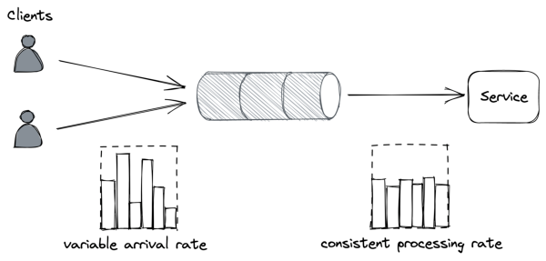
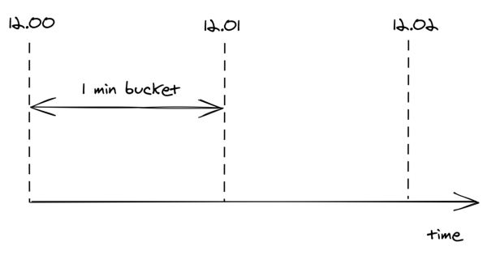
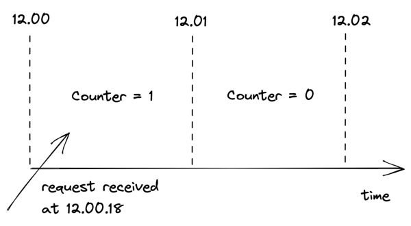
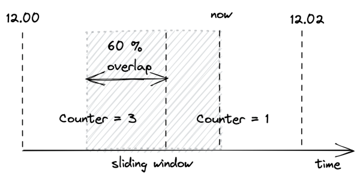
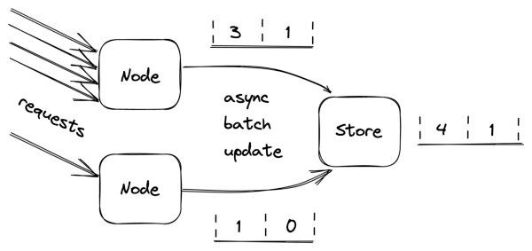

# **Chapter 28** 

# **Upstream resiliency** 

The previous chapter discussed patterns that protect services against downstream failures, like failures to reach an external dependency. In this chapter, we will shift gears and discuss mechanisms to protect against upstream pressure.[1] 

# **28.1 Load shedding** 

A server has very little control over how many requests it receives at any given time. The operating system has a connection queue per port with a limited capacity that, when reached, causes new connection attempts to be rejected immediately. But typically, under extreme load, the server crawls to a halt before that limit is reached as it runs out of resources like memory, threads, sockets, or files. This causes the response time to increase until eventually, the server becomes unavailable to the outside world. 

When a server operates at capacity, it should reject excess requests[2] so that it can dedicate its resources to the requests it’s already processing. For example, the server could use a counter to measure 

> 1We have already met a mechanism to protect against upstream pressure when we discussed health checks in the context of load balancers in chapter 18. 

> 2“Using load shedding to avoid overload,” https://aws.amazon.com/builderslibrary/using-load-shedding-to-avoid-overload 

262 the number of concurrent requests being processed that is incremented when a new request comes in and decreased when a response is sent. The server can then infer whether it’s overloaded by comparing the counter with a threshold that approximates the server’s capacity. 

When the server detects that it’s overloaded, it can reject incoming requests by failing fast and returning a response with status code _503 (Service Unavailable)_ . This technique is also referred to as _load shedding_ . The server doesn’t necessarily have to reject arbitrary requests; for example, if different requests have different priorities, the server could reject only low-priority ones. Alternatively, the server could reject the oldest requests first since those will be the first ones to time out and be retried, so handling them might be a waste of time. 

Unfortunately, rejecting a request doesn’t completely shield the server from the cost of handling it. Depending on how the rejection is implemented, the server might still have to pay the price of opening a TLS connection and reading the request just to reject it. Hence, load shedding can only help so much, and if load keeps increasing, the cost of rejecting requests will eventually take over and degrade the server. 

# **28.2 Load leveling** 

There is an alternative to load shedding, which can be exploited when clients don’t expect a prompt response. The idea is to introduce a messaging channel between the clients and the service. The channel decouples the load directed to the service from its capacity, allowing it to process requests at its own pace. 

This pattern is referred to as load leveling and it’s well suited to fending off short-lived spikes, which the channel smooths out (see Figure 28.1). But if the service doesn’t catch up eventually, a large backlog will build up, which comes with its own problems, as discussed in chapter 23. 

Load-shedding and load leveling don’t address an increase in load 

263 

Figure 28.1: The channel smooths out the load for the consuming service. directly but rather protect a service from getting overloaded. To handle more load, the service needs to be scaled out. This is why these protection mechanisms are typically combined with autoscaling[3] , which detects that the service is running hot and automatically increases its scale to handle the additional load. 

# **28.3 Rate-limiting** 

Rate-limiting, or throttling, is a mechanism that rejects a request when a specific quota is exceeded. A service can have multiple quotas, e.g., for the number of requests or bytes received within a time interval. Quotas are typically applied to specific users, API keys, or IP addresses. 

For example, if a service with a quota of 10 requests per second per API key receives on average 12 requests per second from a specific API key, it will, on average, reject 2 requests per second from that API key. 

When a service rate-limits a request, it needs to return a response with a particular error code so that the sender knows that it failed because a quota has been exhausted. For services with HTTP APIs, 

> 3“Autoscaling,” https://en.wikipedia.org/wiki/Autoscaling 

264 the most common way to do that is by returning a response with status code _429 (Too Many Requests)_ . The response should include additional details about which quota has been exhausted and by how much; it can also include a _Retry-After_ header indicating how long to wait before making a new request: 

If the client application plays by the rules, it will stop hammering the service for some time, shielding the service from non-malicious users monopolizing it by mistake. In addition, this protects against bugs in the clients that cause a client to hit a downstream service for one reason or another repeatedly. 

Rate-limiting is also used to enforce pricing tiers; if users want to use more resources, they should also be willing to pay more. This is how you can offload your service’s cost to your users: have them pay proportionally to their usage and enforce pricing tiers with quotas. 

You would think that rate-limiting also offers strong protection against a DDoS attack, but it only partially protects a service from it. Nothing forbids throttled clients from continuing to hammer a service after getting _429s_ . Rate-limited requests aren’t free either — for example, to rate-limit a request by API key, the service has to pay the price of opening a TLS connection, and at the very least, download part of the request to read the key. Although rate limiting doesn’t fully protect against DDoS attacks, it does help reduce their impact. 

Economies of scale are the only true protection against DDoS attacks. If you run multiple services behind one large gateway service, no matter which of the services behind it are attacked, the gateway service will be able to withstand the attack by rejecting the traffic upstream. The beauty of this approach is that the cost of running the gateway is amortized across all the services that are using it. 

Although rate-limiting has some similarities with load shedding, they are different concepts. Load shedding rejects traffic based on the local state of a process, like the number of requests concurrently processed by it; rate-limiting instead sheds traffic based on 

265 the global state of the system, like the total number of requests concurrently processed for a specific API key across all service instances. And because there is a global state involved, some form of coordination is required. 

# **28.3.1 Single-process implementation** 

The distributed implementation of rate-limiting is interesting in its own right, and it’s well worth spending some time discussing it. We will start with a single-process implementation first and then extend it to a distributed one. 

Suppose we want to enforce a quota of 2 requests per minute, per API key. A naive approach would be to use a doubly-linked list per API key, where each list stores the timestamps of the last N requests received. Whenever a new request comes in, an entry is appended to the list with its corresponding timestamp. Then, periodically, entries older than a minute are purged from the list. 

By keeping track of the list’s length, the process can rate-limit incoming requests by comparing it with the quota. The problem with this approach is that it requires a list per API key, which quickly becomes expensive in terms of memory as it grows with the number of requests received. 

To reduce memory consumption, we need to come up with a way to reduce the storage requirements. One way to do this is by dividing time into buckets of fixed duration, for example of 1 minute, and keeping track of how many requests have been seen within each bucket (see Figure 28.2). 

A bucket contains a numerical counter. When a new request comes in, its timestamp is used to determine the bucket it belongs to. For example, if a request arrives at 12.00.18, the counter of the bucket for minute “12.00” is incremented by 1 (see Figure 28.3). 

With bucketing, we can compress the information about the number of requests seen in a way that doesn’t grow with the number of requests. Now that we have a memory-friendly representation, how can we use it to implement rate-limiting? The idea is to use a 

266 

Figure 28.2: Buckets divide time into 1-minute intervals, which keep track of the number of requests seen. 

Figure 28.3: When a new request comes in, its timestamp is used to determine the bucket it belongs to. sliding window that moves across the buckets in real time, keeping track of the number of requests within it. 

The sliding window represents the interval of time used to decide whether to rate-limit or not. The window’s length depends on the time unit used to define the quota, which in our case is 1 minute. But there is a caveat: a sliding window can overlap with multiple 

267 buckets. To derive the number of requests under the sliding window, we have to compute a weighted sum of the bucket’s counters, where each bucket’s weight is proportional to its overlap with the sliding window (see Figure 28.4). 

Figure 28.4: A bucket’s weight is proportional to its overlap with the sliding window. 

Although this is an approximation, it’s a reasonably good one for our purposes. And it can be made more accurate by increasing the granularity of the buckets. So, for example, we can reduce the approximation error using 30-second buckets rather than 1-minute ones. 

We only have to store as many buckets as the sliding window can overlap with at any given time. For example, with a 1-minute window and a 1-minute bucket length, the sliding window can overlap with at most 2 buckets. Thus, there is no point in storing the third oldest bucket, the fourth oldest one, etc. 

To summarize, this approach requires two counters per API key, which is much more efficient in terms of memory than the naive implementation storing a list of requests per API key. 

# **28.3.2 Distributed implementation** 

When more than one process accepts requests, the local state is no longer good enough, as the quota needs to be enforced on the total 

268 number of requests per API key across all service instances. This requires a shared data store to keep track of the number of requests seen. 

As discussed earlier, we need to store two integers per API key, one for each bucket. When a new request comes in, the process receiving it could fetch the current bucket, update it and write it back to the data store. But that wouldn’t work because two processes could update the same bucket concurrently, which would result in a lost update. The fetch, update, and write operations need to be packaged into a single transaction to avoid any race conditions. 

Although this approach is functionally correct, it’s costly. There are two issues here: transactions are slow, and executing one per request would be very expensive as the data store would have to scale linearly with the number of requests. Also, because the data store is a hard dependency, the service will become unavailable if it can’t reach it. 

Let’s address these issues. Rather than using transactions, we can use a single atomic _get-and-increment_ operation that most data stores provide. Alternatively, the same can be emulated with a _compare-and-swap_ . These atomic operations have much better performance than transactions. 

Now, rather than updating the data store on each request, the process can batch bucket updates in memory for some time and flush them asynchronously to the data store at the end of it (see Figure 28.5). This reduces the shared state’s accuracy, but it’s a good trade-off as it reduces the load on the data store and the number of requests sent to it. 

What happens if the data store is down? Remember the CAP theorem’s essence: when there is a network fault, we can either sacrifice consistency and keep our system up or maintain consistency and stop serving requests. In our case, temporarily rejecting requests just because the data store used for rate-limiting is not reachable could damage the business. Instead, it’s safer to keep serving re269 

Figure 28.5: Servers batch bucket updates in memory for some time, and flush them asynchronously to the data store at the end of it. quests based on the last state read from the store.[4] 

# **28.4 Constant work** 

When overload, configuration changes, or faults force an application to behave differently from usual, we say the application has a multi-modal behavior. Some of these _modes_ might trigger rare bugs, conflict with mechanisms that assume the happy path, and more generally make life harder for operators, since their mental model of how the application behaves is no longer valid. Thus, as a general rule of thumb, we should strive to minimize the number of modes. 

For example, simple key-value stores are favored over relational databases in data planes because they tend to have predictable performance[5] . A relational database has many operational modes due to hidden optimizations, which can change how specific queries perform from one execution to another. Instead, dumb key-value stores behave predictably for a given query, which guarantees that 

> 4 This is another application of the concept of _static stability_ , first introduced in chapter 22. 5“Some opinionated thoughts on SQL databases,” https://blog.nelhage.com/p ost/some-opinionated-sql-takes/ 

270 

# there won’t be any surprises. 

A common reason for a system to change behavior is overload, which can cause the system to become slower and degrade at the worst possible time. Ideally, the worst- and average-case behavior shouldn’t differ. One way to achieve that is by exploiting the _constant work pattern_ , which keeps the work per unit time constant. 

The idea is to have the system perform the same amount of work[6] under high load as under average load. And, if there is any variation under stress, it should be because the system is performing better, not worse. Such a system is also said to be _antifragile_ . This is a different property from resiliency; a resilient system keeps operating under extreme load, while an antifragile one performs better. 

We have already seen one application of the constant work pattern when discussing the propagation of configuration changes from the control plane to the data plane in chapter 22. For example, suppose we have a configuration store (control plane) that stores a bag of settings for each user, like the quotas used by the API gateway (data plane) to rate-limit requests. When a setting changes for a specific user, the control plane needs to broadcast it to the data plane. However, as each change is a separate independent unit of work, the data plane needs to perform work proportional to the number of changes. 

If you don’t see how this could be a problem, imagine that a large number of settings are updated for the majority of users at the same time (e.g., quotas changed due to a business decision). This could cause an unexpectedly large number of individual update messages to be sent to every data plane instance, which could struggle to handle them. 

The workaround to this problem is simple but powerful. The control plane can periodically dump the settings of all users to a file in a scalable and highly available file store like Azure Storage or AWS S3. The dump includes the configuration settings of all users, even the ones for which there were no changes. Data plane instances 

> 6“Reliability, constant work, and a good cup of coffee,” https://aws.amazon.c om/builders-library/reliability-and-constant-work/ 

271 can then periodically read the dump in bulk and refresh their local view of the system’s configuration. Thus, no matter how many settings change, the control plane periodically writes a file to the data store, and the data plane periodically reads it. 

We can take this pattern to the extreme and pre-allocate empty configuration slots for the maximum number of supported users. This guarantees that as the number of users grows, the work required to propagate changes remains stable. Additionally, doing so allows to stress-test the system and understand its behavior, knowing that it will behave the same under all circumstances. Although this limits the number of users, a limit exists regardless of whether the constant work pattern is used or not. This approach is typically used in cellular architectures (see 26.2), where a single cell has a well-defined maximum size and the system is scaled out by creating new cells. 

The beauty of using the constant work pattern is that the data plane periodically performs the same amount of work in bulk, no matter how many configuration settings have changed. This makes updating settings reliable and predictable. Also, periodically writing and reading a large file is much simpler to implement correctly than a complex mechanism that only sends what changed. 

Another advantage of this approach is that it’s robust against a whole variety of faults thanks to its self-healing properties. If the configuration dump gets corrupted for whatever reason, no harm is done since the next update will fix it. And if a faulty update was pushed to all users by mistake, reverting it is as simple as creating a new dump and waiting it out. In contrast, the solution that sends individual updates is much harder to implement correctly, as the data plane needs complex logic to handle and heal from corrupted updates. 

To sum up, performing constant work is more expensive than doing just the necessary work. Still, it’s often worth considering it, given the increase in reliability and reduction in complexity it enables. 

# **Summary** 

As the number of components or operations in a system increases, so does the number of failures, and eventually, anything that can happen will happen. In my team, we humorously refer to this as “cruel math.” 

If you talk to an engineer responsible for a production system, you will quickly realize that they tend to be more worried about minimizing and tolerating failures than how to further scale out their systems. The reason for that is that once you have an architecture that scales to handle your current load, you will be mostly concerned with tolerating faults until you eventually reach the next scalability bottleneck. 

What you should take away from this part is that failures are inevitable since, no matter how hard you try, it’s just impossible to build an infallible system. When you can’t design away some failure modes (e.g., with constant work), the best you can do is to reduce their blast radius and stop the cracks from propagating from one component to the other. 

