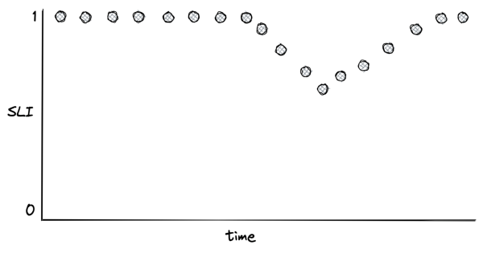
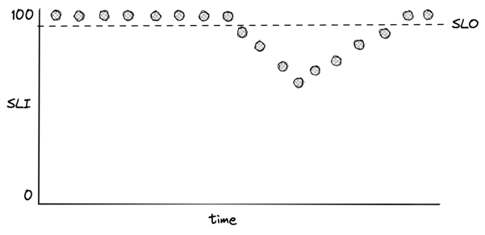
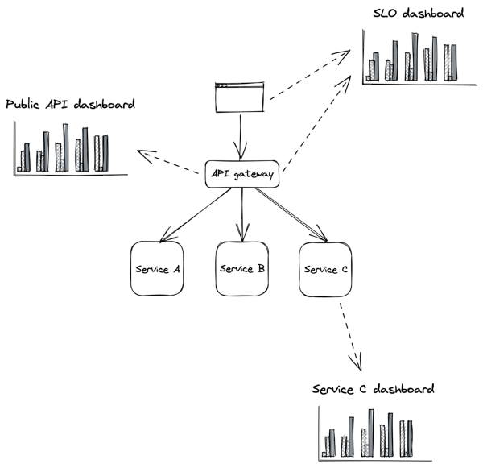

# **Chapter 31** 

# **Monitoring** 

Monitoring is primarily used to detect failures that impact users in production and to trigger notifications (or alerts) to the human operators responsible for the system. Another important use case for monitoring is to provide a high-level overview of the system’s health via dashboards. 

In the early days, monitoring was used mostly to report whether a service was up, without much visibility of what was going on inside (black-box monitoring). In time, developers also started to instrument their applications to report whether specific features worked as expected (white-box monitoring). This was popularized with the introduction of statsd[1] by Etsy, which normalized collecting application-level measurements. While black-box monitoring is useful for detecting the symptoms of a failure, white-box monitoring can help identify the root cause. 

The main use case for black-box monitoring is to monitor external dependencies, such as third-party APIs, and validate how users perceive the performance and health of a service from the outside. A common black-box approach is to periodically run scripts ( _synthetics_[2] ) that send test requests to external API endpoints and monitor how long they took and whether they were successful. Synthetics are deployed in the same regions the application’s users are and hit the same endpoints they do. Because they exercise the system’s public surface from the outside, they can catch issues that aren’t visible from within the application, like connectivity problems. Synthetics are also useful for detecting issues with APIs that aren’t exercised often by users. 

> 1“Measure Anything, Measure Everything,” https://codeascraft.com/2011/0 2/15/measure-anything-measure-everything/ 

For example, if the DNS server of a service were down, the issue would be visible to synthetics, since they wouldn’t be able to resolve its IP address. However, the service itself would think everything was fine, and it was just getting fewer requests than usual. 

# **31.1 Metrics** 

A _metric_ is a time series of raw measurements (samples) of resource usage (e.g., CPU utilization) or behavior (e.g., number of requests that failed), where each sample is represented by a floating-point number and a timestamp. 

Commonly, a metric can also be tagged with a set of key-value pairs ( _labels_ ). For example, the label could represent the region, data center, cluster, or node where the service is running. Labels make it easy to slice and dice the data and eliminate the instrumentation cost of manually creating a metric for each label combination. However, because every distinct combination of labels is a different metric, tagging generates a large number of metrics, making them challenging to store and process. 

At the very least, a service should emit metrics about its load (e.g., request throughput), its internal state (e.g., in-memory cache size), and its dependencies’ availability and performance (e.g., data store response time). Combined with the metrics emitted by downstream services, this allows operators to identify problems quickly. But this requires explicit code changes and a deliberateeffort by developers to instrument their code.

> 2“Using synthetic monitoring,” https://docs.aws.amazon.com/AmazonClou dWatch/latest/monitoring/CloudWatch_Synthetics_Canaries.html

For example, take a fictitious HTTP handler that returns a resource. There is a whole range of questions we will want to be able to answer once it’s running in production[3] : 

**def** get_resource(id): 

- resource = self._cache.get(id) _# in-process cache_ 

_# Is the id valid?_ 

- _# Was there a cache hit?_ 

- _# How long has the resource been in the cache?_ 

# **if** resource **is not** None: 

**return** resource resource = self._repository.get(id) 

- _# Did the remote call fail, and if so, why?_ 

- _# Did the remote call time out?_ 

- _# How long did the call take?_ self._cache[id] = resource 

_# What's the size of the cache?_ 

# **return** resource 

_# How long did it take for the handler to run?_ 

Now, suppose we want to record the number of requests the handler failed to serve. One way to do that is with an event-based approach — whenever the handler fails to handle a request, it reports a failure count of 1 in an _event_[4] to a local telemetry agent, e.g.: 

{ 

"failureCount": 1, 

"serviceRegion": "EastUs2", "timestamp": 1614438079 

> 3I have omitted error handling for simplicity. 

> 4We will talk more about event logs in section 32.1; for now, assume an event is just a dictionary. 

# } 

The agent batches these events and emits them periodically to a remote telemetry service, which persists them in a dedicated data store for event logs. For example, this is the approach taken by Azure Monitor’s log-based metrics[5] . 

As you can imagine, this is quite expensive, since the load on the telemetry service increases with the number of events ingested. Events are also costly to aggregate at query time — suppose we want to retrieve the number of failures in North Europe over the past month; we would have to issue a query that requires fetching, filtering, and aggregating potentially trillions of events within that time period. 

So is there a way to reduce costs at query time? Because metrics are time series, they can be modeled and manipulated with mathematical tools. For example, time-series samples can be pre-aggregated over fixed time periods (e.g., 1 minute, 5 minutes, 1 hour, etc.) and represented with summary statistics such as the sum, average, or percentiles. 

Going back to our example, the telemetry service could preaggregate the failure count events at ingestion time. If the aggregation (i.e., the sum in our example) were to happen with a period of one hour, we would have one _failureCount_ metric per _serviceRegion_ , each containing one sample per hour, e.g.: 

"00:00", 561, "01:00", 42, "02:00", 61, ... 

The ingestion service could also create multiple pre-aggregates with different periods. This way, the pre-aggregated metric with the best period that satisfies the query can be chosen at query 

> 5“Log-based metrics in Application Insights,” https://docs.microsoft.com/enus/azure/azure-monitor/app/pre-aggregated-metrics-log-metrics#log-basedmetrics time. For example, CloudWatch[6] (the telemetry service used by AWS) pre-aggregates data as it’s ingested. 

We can take this idea one step further and also reduce ingestion costs by having the local telemetry agents pre-aggregate metrics client-side. By combining client- and server-side pre-aggregation, we can drastically reduce the bandwidth, compute, and storage requirements for metrics. However, this comes at a cost: we lose the ability to re-aggregate metrics after ingestion because we no longer have access to the original events that generated them. For example, if a metric is pre-aggregated over a period of 1 hour, it can’t later be re-aggregated over a period of 5 minutes without the original events. 

Because metrics are mainly used for alerting and visualization purposes, they are usually persisted in a pre-aggregated form in a data store specialized for efficient time series storage[7] . 

# **31.2 Service-level indicators** 

As noted before, one of the main use cases for metrics is alerting. But that doesn’t mean we should create alerts for every possible metric — for example, it’s useless to be alerted in the middle of the night because a service had a big spike in memory consumption a few minutes earlier. 

In this section, we will discuss one specific metric category that lends itself well to alerting: _service-level indicators_ (SLIs). An SLI is a metric that measures one aspect of the _level of service_ provided by a service to its users, like the response time, error rate, or throughput. SLIs are typically aggregated over a rolling time window and represented with a summary statistic, like an average or percentile. 

SLIs are best defined as a ratio of two metrics: the number of “good events” over the total number of events. That makes the ratio easyto interpret: 0 means the service is completely broken and 1 that whatever is being measured is working as expected (see Figure 31.1). As we will see later in the chapter, ratios also simplify the configuration of alerts. Some commonly used SLIs for services are:

> 6“Amazon CloudWatch concepts,” https://docs.aws.amazon.com/AmazonCl oudWatch/latest/monitoring/cloudwatch_concepts.html 

> 7like, e.g., Druid; see “A Real-time Analytical Data Store,” http://static.druid.i o/docs/druid.pdf

- _Response time_ — The fraction of requests that are completed faster than a given threshold. 

- _Availability_ — The proportion of time the service was usable, defined as the number of successful requests over the total number of requests. 

Figure 31.1: An SLI defined as the ratio of good events over the total number of events 

Once we have decided what to measure, we need to decide where to measure it. Take the response time, for example. Should we measure the response time as seen by the service, load balancer, or clients? Ideally, we should select the metric that best represents the users’ experience. If that’s too costly to collect, we should pick the next best candidate. In the previous example, the client metric is the most meaningful of the lot since it accounts for delays and hiccups through the entire request path. 

Now, how should we measure the response time? Measurements can be affected by many factors, such as network delays, page faults, or heavy context switching. Since every request does not take the same amount of time, response times are best repre303 sented with a distribution, which usually is right-skewed and long-tailed[8] . 

A distribution can be summarized with a statistic. Take the average, for example. While it has its uses, it doesn’t tell us much about the proportion of requests experiencing a specific response time, and all it takes to skew the average is one large outlier. For example, suppose we collected 100 response times, of which 99 are 1 second, and one is 10 minutes. In this case, the average is nearly 7 seconds. So even though 99% of the requests experience a response time of 1 second, the average is 7 times higher than that. 

A better way to represent the distribution of response times is with percentiles. A percentile is the value below which a percentage of the response times fall. For example, if the 99th percentile is 1 second, then 99% of requests have a response time below or equal to 1 second. The upper percentiles of a response time distribution, like the 99th and 99.9th percentiles, are also called _long-tail latencies_ . Even though only a small fraction of requests experience these extreme latencies, it can impact the most important users for the business. They are the ones that make the highest number of requests and thus have a higher chance of experiencing tail latencies. There are studies[9] that show that high latencies negatively affect revenues: a mere 100-millisecond delay in load time can hurt conversion rates by 7 percent. 

Also, long-tail latencies can dramatically impact a service. For example, suppose a service on average uses about 2K threads to serve 10K requests per second. By Little’s Law[10] , the average response time of a thread is 200 ms. Now, if suddenly 1% of requests start taking 20 seconds to complete (e.g., because of a congested switch and relaxed timeouts), 2K additional threads are needed to dealjust with the slow requests. So the number of threads used by the service has to double to sustain the load!

> 8“latency: a primer,” https://igor.io/latency/ 

> 9“Akamai Online Retail Performance Report: Milliseconds Are Critical,” https: //www.akamai.com/newsroom/press-release/akamai-releases-spring-2017state-of-online-retail-performance-report 

> 10Little’s law says the average number of items in a system equals the average rate at which new items arrive multiplied by the average time an item spends in the system; see “Back of the envelope estimation hacks,” https://robertovitillo.c om/back-of-the-envelope-estimation-hacks/

Measuring long-tail latencies and keeping them in check doesn’t just make our users happy but also drastically improves the resiliency of our systems while reducing their operational costs. Intuitively, by reducing the long-tail latency (worst-case scenario), we also happen to improve the average-case scenario. 

# **31.3 Service-level objectives** 

A _service-level objective_ (SLO) defines a range of acceptable values for an SLI within which the service is considered to be in a healthy state (see Figure 31.2). An SLO sets the expectation to the service’s users of how it should behave when it’s functioning correctly. Service owners can also use SLOs to define a service-level agreement (SLA) with their users — a contractual agreement that dictates what happens when an SLO isn’t met, generally resulting in financial consequences. 

For example, an SLO could define that 99% of API calls to endpoint X should complete below 200 ms, as measured over a rolling window of 1 week. Another way to look at it is that it’s acceptable for up to 1% of requests within a rolling week to have a latency higher than 200 ms. That 1% is also called the _error budget_ , which represents the number of failures that can be tolerated. 

SLOs are helpful for alerting purposes and also help the team prioritize repair tasks. For example, the team could agree that when an error budget is exhausted, repair items will take precedence over new features until the SLO is repaired. Furthermore, an incident’s importance can be measured by how much of the error budget has been burned. For example, an incident that burned 20% of the error budget is more important than one that burned only 1%. 

Smaller time windows force the team to act quicker and prioritize bug fixes and repair items, while longer windows are better suited to make long-term decisions about which projects to invest 

Figure 31.2: An SLO defines the range of acceptable values for an SLI. in. Consequently, it makes sense to have multiple SLOs with different window sizes. 

How strict should SLOs be? Choosing the right target range is harder than it looks. If it’s too lenient, we won’t detect user-facing issues; if it’s too strict, engineering time will be wasted with microoptimizations that yield diminishing returns. Even if we could guarantee 100% reliability for our systems (which is impossible), we can’t make guarantees for anything that our users depend on to access our service and which is outside our control, like their last-mile connection. Thus, 100% reliability doesn’t translate into a 100% reliable experience for users. 

When setting the target range for SLOs, it’s reasonable to start with comfortable ranges and tighten them as we build confidence. We shouldn’t just pick targets our service meets today that might become unattainable in a year after load increases. Instead, we should work backward from what users care about. In general, anything above 3 nines of availability is very costly to achieve and provides diminishing returns. 

Also, we should strive to keep things simple and have as few SLOs as possible that provide a good enough indication of the desired service level and review them periodically. For example, suppose we discover that a specific user-facing issue generated many sup306 port tickets, but none of our SLOs showed any degradation. In that case, the SLOs might be too relaxed or simply not capture a specific use case. 

SLOs need to be agreed on with multiple stakeholders. If the error budget is being burned too rapidly or has been exhausted, repair items have to take priority over features. Engineers need to agree that the targets are achievable without excessive toil. Product managers also have to agree that the targets guarantee a good user experience. As Google’s SRE book mentions[11] : “if you can’t ever win a conversation about priorities by quoting a particular SLO, it’s probably not worth having that SLO.” 

It’s worth mentioning that users can become over-reliant on the actual behavior of our service rather than its documented SLA. To prevent that, we can periodically inject controlled failures[12] in production — also known as chaos testing. These controlled failures ensure the dependencies can cope with the targeted service level and are not making unrealistic assumptions. As an added benefit, they also help validate that resiliency mechanisms work as expected. 

# **31.4 Alerts** 

Alerting is the part of a monitoring system that triggers an action when a specific condition happens, like a metric crossing a threshold. Depending on the severity and the type of the alert, the action can range from running some automation, like restarting a service instance, to ringing the phone of a human operator who is on call. In the rest of this section, we will mostly focus on the latter case. 

For an alert to be useful, it has to be actionable. The operator shouldn’t spend time exploring dashboards to assess the alert’s impact and urgency. For example, an alert signaling a spike in CPU usage is not useful as it’s not clear whether it has any impactives/

> 11“Service Level Objectives,” https://sre.google/sre-book/service-level-object

ives/ 

> 12“Chaos engineering,” https://en.wikipedia.org/wiki/Chaos_engineering on the system without further investigation. On the other hand, an SLO is a good candidate for an alert because it quantifies the impact on the users. The SLO’s error budget can be monitored to trigger an alert whenever a large fraction of it has been consumed. 

Before discussing how to define an alert, it’s important to understand that there is a trade-off between its precision and recall. Formally, _precision_ is the fraction of significant events (i.e., actual issues) over the total number of alerts, while _recall_ is the ratio of significant events that triggered an alert. Alerts with low precision are noisy and often not actionable, while alerts with low recall don’t always trigger during an outage. Although it would be nice to have 100% precision and recall, improving one typically lowers the other, and so a compromise needs to be made. 

Suppose we have an availability SLO of 99% over 30 days, and we would like to configure an alert for it. A naive way would be to trigger an alert whenever the availability goes below 99% within a relatively short time window, like an hour. But how much of the error budget has actually been burned by the time the alert triggers? Because the time window of the alert is one hour, and the SLO error budget is defined over 30 days, the percentage of error budget that has been spent when the alert triggers is 30 days1 hour[=][0.14%][.][A] system is never 100% healthy, since there is always something failing at any given time. So being notified that 0.14% of the SLO’s error budget has been burned is not useful. In this case, we have a high recall but a low precision. 

We can improve the alert’s precision by increasing the amount of time the condition needs to be true. The problem is that now the alert will take longer to trigger, even during an actual outage. The alternative is to alert based on how fast the error budget is burning, also known as the _burn rate_ , which lowers the detection time. The burn rate is defined as the percentage of the error budget consumed over the percentage of the SLO time window that has elapsed — it’s the rate of exhaustion of the error budget. So using our previous example, a burn rate of 1 means the error budget will be exhausted precisely in 30 days; if the rate is 2, then it will be 15 days; if the rate is 3, it will be 10 days, and so on. 

To improve recall, we can have multiple alerts with different thresholds. For example, a burn rate below 2 could be classified as a low-severity alert to be investigated during working hours, while a burn rate over 10 could trigger an automated call to an engineer. The SRE workbook has some great examples[13] of how to configure alerts based on burn rates. While the majority of alerts should be based on SLOs, some should trigger for known failure modes that we haven’t had the time to design or debug away. For example, suppose we know a service suffers from a memory leak that has led to an incident in the past, but we haven’t yet managed to track down the root cause. In this case, as a temporary mitigation, we could define an alert that triggers an automated restart when a service instance is running out of memory. 

# **31.5 Dashboards** 

After alerting, the other main use case for metrics is to power realtime dashboards that display the overall health of a system. Unfortunately, dashboards can easily become a dumping ground for charts that end up being forgotten, have questionable usefulness, or are just plain confusing. Good dashboards don’t happen by coincidence. In this section, we will discuss some of the best practices for creating useful dashboards. 

When creating a dashboard, the first decision we have to make is to decide who the audience is[14] and what they are looking for. Then, given the audience, we can work backward to decide which charts, and therefore metrics, to include. 

The categories of dashboards presented here (see Figure 31.3) are by no means standard but should give you an idea of how to organize dashboards. 

# **SLO dashboard** 

> 13“Alerting on SLOs,” https://sre.google/workbook/alerting-on-slos/ 

> 14“Building dashboards for operational visibility,” https://aws.amazon.com/b

uilders-library/building-dashboards-for-operational-visibility 

Figure 31.3: Dashboards should be tailored to their audience. 

The SLO summary dashboard is designed to be used by various stakeholders from across the organization to gain visibility into the system’s health as represented by its SLOs. During an incident, this dashboard quantifies the impact the incident is having on the users. 

# **Public API dashboard** 

This dashboard displays metrics about the system’s public API endpoints, which helps operators identify problematic paths during an incident. For each endpoint, the dashboard exposes several metrics related to request messages, request handling, and response messages, like: 

- Number of requests received or messages pulled from a mes310 saging broker, request size statistics, authentication issues, etc. 

- Request handling duration, availability and response time of external dependencies, etc. 

- Counts per response type, size of responses, etc. 

# **Service dashboard** 

A service dashboard displays service-specific implementation details, which require an in-depth understanding of its inner workings. Unlike the previous dashboards, this one is primarily used by the team that owns the service. Beyond service-specific metrics, a service dashboard should also contain metrics of upstream dependencies like load balancers and messaging queues and downstream dependencies like data stores. 

This dashboard offers a first entry point into what’s going on within the service when debugging. As we will later learn when discussing observability, this high-level view is just the starting point. The operator typically drills down into the metrics by segmenting them further and eventually reaches for raw logs and traces to get more detail. 

# **31.5.1 Best practices** 

As new metrics are added and old ones removed, charts and dashboards need to be modified and kept in sync across multiple environments (e.g., pre-production and production). The most effective way to achieve that is by defining dashboards and charts with a domain-specific language and version-controlling them just like code. This allows dashboards to be updated from the same pull request that contains related code changes without manually updating dashboards, which is error-prone. 

As dashboards render top to bottom, the most important charts should always be located at the very top. Also, charts should be rendered with a default timezone, like UTC, to ease the communication between people located in different parts of the world when looking at the same data. 

All charts in the same dashboard should use the same time resolution (e.g., 1 minute, 5 minutes, 1 hour, etc.) and range (24 hours, 7 days, etc.). This makes it easy to visually correlate anomalies across charts in the same dashboard. We can pick the default time range and resolution based on the dashboard’s most common use case. For example, a 1-hour range with a 1-minute resolution is best for monitoring an ongoing incident, while a 1-year range with a 1-day resolution is best for capacity planning. 

We should keep the number of data points and metrics on the same chart to a minimum. Rendering too many points doesn’t just make charts slow to download/render but also makes it hard to interpret them and spot anomalies. 

A chart should contain only metrics with similar ranges (min and max values); otherwise, the metric with the largest range can completely hide the others with smaller ranges. For that reason, it makes sense to split related statistics for the same metric into multiple charts. For example, the 10th percentile, average and 90th percentile of a metric can be displayed in one chart, and the 0.1th percentile, 99.9th percentile, minimum and maximum in another. 

A chart should also contain useful annotations, like: 

- a description of the chart with links to runbooks, related dashboards, and escalation contacts; 

- a horizontal line for each configured alert threshold, if any; 

- a vertical line for each relevant deployment. 

Metrics that are only emitted when an error condition occurs can be hard to interpret as charts will show wide gaps between the data points, leaving the operator wondering whether the service stopped emitting that metric due to a bug. To avoid this, it’s best practice to emit a metric using a value of zero in the absence of an error and a value of 1 in the presence of it. 

# **31.6 Being on call** 

A healthy on-call rotation is only possible when services are built from the ground up with reliability and operability in mind. By making the developers responsible for operating what they build, they are incentivized to reduce the operational toll to a minimum. They are also in the best position to be on call since they are intimately familiar with the system’s architecture, brick walls, and trade-offs. 

Being on call can be very stressful. Even when there are no callouts, just the thought of not having the usual freedom outside of regular working hours can cause a great deal of anxiety. This is why being on call should be compensated, and there shouldn’t be any expectations for the on-call engineer to make any progress on feature work. Since they will be interrupted by alerts, they should make the most of it and be given free rein to improve the on-call experience by, e.g., revising dashboards or improving resiliency mechanisms. 

Achieving a healthy on-call rotation is only possible when alerts are actionable. When an alert triggers, to the very least, it should link to relevant dashboards and a run-book that lists the actions the engineer should take[15] . Unless the alert was a false positive, all actions taken by the operator should be communicated into a shared channel like a global chat accessible by other teams. This allows other engineers to chime in, track the incident’s progress, and more easily hand over an ongoing incident to someone else. 

The first step to address an alert is to mitigate it, not fix the underlying root cause that created it. A new artifact has been rolled out that degrades the service? Roll it back. The service can’t cope with the load even though it hasn’t increased? Scale it out. 

Once the incident has been mitigated, the next step is to understand the root cause and come up with ways to prevent it from happening again. The greater the impact was, as measured bythe SLOs, the more time we should spend on this. Incidents that burned a significant fraction of an SLO’s error budget require a formal _postmortem_ . The goal of the postmortem is to understand the incident’s root cause and come up with a set of repair items that will prevent it from happening again. Ideally, there should also be an agreement in the team that if an SLO’s error budget is burned or the number of alerts spirals out of control, the whole team stops working on new features to focus exclusively on reliability until a healthy on-call rotation has been restored.

> 15Ideally, we should automate what we can to minimize manual actions that operators need to perform. As it turns out, machines are good at following instructions. 

The SRE books[16] provide a wealth of information and best practices regarding setting up a healthy on-call rotation. 

16“SRE Books,” https://sre.google/books/ 

