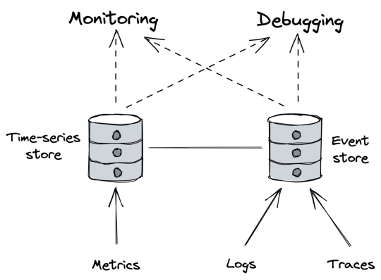
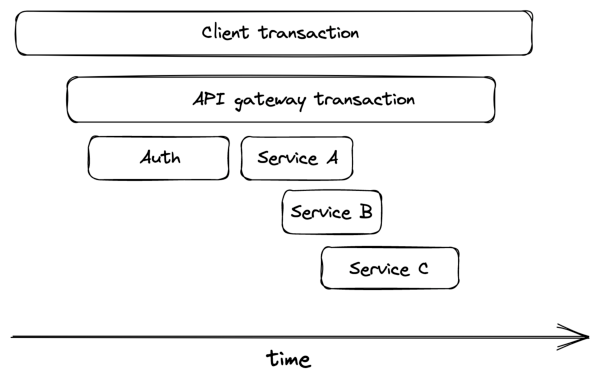

# **Chapter 32** 

# **Observability** 

A distributed system is never 100% healthy since, at any given time, there is always something failing. A whole range of failure modes can be tolerated, thanks to relaxed consistency models and resiliency mechanisms like rate limiting, retries, and circuit breakers. But, unfortunately, they also increase the system’s complexity. And with more complexity, it becomes increasingly harder to reason about the multitude of emergent behaviors the system might experience, which are impossible to predict up front. 

As discussed earlier, human operators are still a fundamental part of operating a service as there are things that can’t be automated, like debugging the root cause of a failure. When debugging, the operator makes a hypothesis and tries to validate it. For example, the operator might get suspicious after noticing that the variance of their service’s response time has increased slowly but steadily over the past weeks, indicating that some requests take much longer than others. After correlating the increase in variance with an increase in traffic, the operator hypothesizes that the service is getting closer to hitting a constraint, like a resource limit. But metrics and charts alone won’t help to validate this hypothesis. 

Observability is a set of tools that provide granular insights into a system in production, allowing one to understand its emergent behaviors. A good observability platform strives to minimize the time it takes to validate hypotheses. This requires granular events with rich contexts since it’s impossible to know up front what will be useful in the future. 

At the core of observability, we find telemetry sources like _metrics_ , _event logs_ , and _traces_ . Metrics are stored in time-series data stores that have high throughput but struggle with high dimensionality. Conversely, event logs and traces end up in stores that can handle high-dimensional data[1] but struggle with high throughput. Metrics are mainly used for monitoring, while event logs and traces are mainly for debugging. 

Observability is a superset of monitoring. While monitoring is focused exclusively on tracking a system’s health, observability also provides tools to understand and debug the system. For example, monitoring on its own is good at detecting failure symptoms but less so at explaining their root cause (see Figure 32.1). 

# **32.1 Logs** 

A _log_ is an immutable list of time-stamped events that happened over time. An _event_ can have different formats. In its simplest form, it’s just free-form text. It can also be structured and represented with a textual format like JSON or a binary one like Protobuf. When structured, an event is typically represented with a bag of key-value pairs: 

{ 

"failureCount": 1, 

"serviceRegion": "EastUs2", "timestamp": 1614438079 

} 

# Logs can originate from our services or external dependencies, like 

> 1Azure Data Explorer is one such event store, see “Azure Data Explorer: a big data analytics cloud platform optimized for interactive, adhoc queries over structured, semi-structured and unstructured data,” https://azure.microsoft.com/me

diahandler/files/resourcefiles/azure-data-explorer/Azure_Data_Explorer_whi te_paper.pdf 

Figure 32.1: Observability is a superset of monitoring. message brokers, proxies, data stores, etc. Most languages offer libraries that make it easy to emit structured logs. Logs are typically dumped to disk files, which are sent by an agent to an external log collector asynchronously, like an ELK stack[2] or AWS CloudWatch logs. 

Logs provide a wealth of information about everything that’s happening in a service, assuming it was instrumented properly. They are particularly helpful for debugging purposes, as they allow us to trace back the root cause from a symptom, like a service instance crash. They also help investigate long-tail behaviors that are invisible to metrics summarized with averages and percentiles, which can’t explain why a specific user request is failing. 

Logs are simple to emit, particularly so free-form textual ones. But that’s pretty much the only advantage they have compared to metrics and other telemetry data. Logging libraries can add overhead to our services if misused, especially when they are not asynchronous and block while writing to disk. Also, if the disk fills up due to excessive logging, at best we lose logs, and at worst, 

2“What is the ELK Stack?,” https://www.elastic.co/what-is/elk-stack the service instance stops working correctly. 

Ingesting, processing, and storing massive troves of data is not cheap either, no matter whether we plan to do this in-house or use a third-party service. Although structured binary logs are more efficient than textual ones, they are still expensive due to their high dimensionality. 

Finally, but no less importantly, logs have a low signal-to-noise ratio because they are fine-grained and service-specific, making it challenging to extract useful information. 

# **Best practices** 

To make the job of the engineer drilling into the logs less painful, all the data about a specific _work unit_ should be stored in a single event. A work unit typically corresponds to a request or a message pulled from a queue. To effectively implement this pattern, code paths handling work units need to pass around a context object containing the event being built. 

An event should contain useful information about the work unit, like who created it, what it was for, and whether it succeeded or failed. It should also include measurements, like how long specific operations took. In addition, every network call performed within the work unit needs to be instrumented and log, e.g., its response time and status code. Finally, data logged to the event should be sanitized and stripped of potentially sensitive properties that developers shouldn’t have access to, like users’ personal data. 

Collating all data within a single event for a work unit minimizes the need for joins but doesn’t completely eliminate it. For example, if a service calls another downstream, we will have to perform a join to correlate the caller’s event log with the callee’s one to understand why the remote call failed. To make that possible, every event should include the identifier of the request (or message) for the work unit. 

# **Costs** 

There are various ways to keep the costs of logging under con319 trol. A simple approach is to have different logging levels (e.g., debug, info, warning, error) controlled by a dynamic knob that determines which ones are emitted. This allows operators to increase the logging verbosity for investigation purposes and reduce costs when granular logs aren’t needed. 

Sampling[3] is another tool at our disposal for reducing verbosity. For example, a service could log only every nth event. Additionally, events can also be prioritized based on their expected signalto-noise ratio: logging failed requests should have a higher sampling frequency than logging successful ones. 

The options discussed so far only reduce the logging verbosity on a single node. As we scale out and add more nodes, the logging volume will necessarily increase. Even with the best intentions, someone could check in a bug that leads to excessive logging. To avoid costs soaring through the roof or overloading our log collector service, log collectors need to be able to rate-limit requests. 

Of course, we can always decide to create in-memory aggregates (e.g., metrics) from the measurements collected in events and emit just those rather than raw logs. However, by doing so, we trade off the ability to drill down into the aggregates if needed. 

# **32.2 Traces** 

Tracing captures the entire lifespan of a request as it propagates throughout the services of a distributed system. A _trace_ is a list of causally-related spans that represent the execution flow of a request in a system. A _span_ represents an interval of time that maps to a logical operation or work unit and contains a bag of key-value pairs (see Figure 32.2). 

When a request begins, it’s assigned a unique trace ID. The trace ID is propagated from one stage to another at every fork in the local execution flow from one thread to another, and from caller to callee in a network call (through HTTP headers, for example).mic-sampling-by-example/

> 3“Dynamic Sampling by Example,” https://www.honeycomb.io/blog/dyna

Figure 32.2: An execution flow can be represented with spans. 

Each stage is represented with a span — an event containing the trace ID. 

When a span ends, it’s emitted to a collector service, which assembles it into a trace by stitching it together with the other spans belonging to the same trace. Popular distributed tracing collectors include Open Zipkin[4] and AWS X-ray[5] . 

Traces allow developers to: 

- debug issues affecting very specific requests, which can be used to investigate failed requests raised by customers in support tickets; 

- debug rare issues that affect only an extremely small fraction of requests; 

- debug issues that affect a large fraction of requests that have something in common, like high response times for requests that hit a specific subset of service instances; 

- identify bottlenecks in the end-to-end request path; 

- identify which users hit which downstream services and in what proportion (also referred to as _resource attribution_ ), which can be used for rate-limiting or billing purposes.

> 4“Zipkin: a distributed tracing system,” https://zipkin.io/ 

> 5“AWS X-Ray,” https://aws.amazon.com/xray/

Tracing is challenging to retrofit into an existing system since it requires every component in the request path to be modified to propagate the trace context from one stage to the other. And it’s not just the components that are under our control that need to support tracing; third-party frameworks, libraries, and services need to as well.[6] . 

# **32.3 Putting it all together** 

The main drawback of event logs is that they are fine-grained and service-specific. When a user request flows through a system, it can pass through several services. A specific event only contains information for the work unit of one specific service, so it can’t be of much use for debugging the entire request flow. Similarly, a single event doesn’t give much information about the health or state of a specific service. 

This is where metrics and traces come in. We can think of them as abstractions, or derived views, built from event logs and optimized for specific use cases. A metric is a time series of summary statistics derived by aggregating counters or observations over multiple events. For example, we could emit counters in events and have the backend roll them up into metrics as they are ingested. In fact, this is how some metric-collection systems work. 

Similarly, a trace can be derived by aggregating all events belonging to the lifecycle of a specific user request into an ordered list. Just like in the previous case, we can emit individual span events and have the backend aggregate them together into traces. 

> 6The service mesh pattern can help retrofit tracing. 

