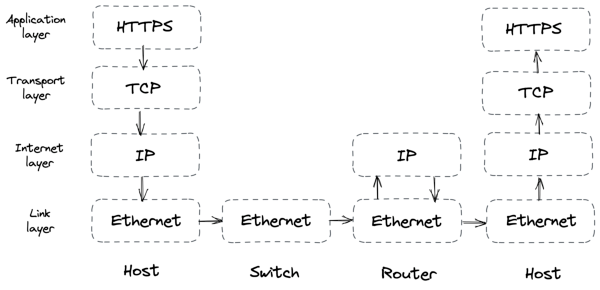

# **Part I** 

**Communication** 

# **Introduction** 

_“The network is reliable.”_ 

– Fallacies of distributed computing, L. Peter Deutsch 

Communication between processes over the network, or _interprocess communication_ (IPC), is at the heart of distributed systems — it’s what makes distributed systems distributed. In order for processes to communicate, they need to agree on a set of rules that determine how data is processed and formatted. Network protocols specify such rules. 

The protocols are arranged in a stack[6] , where each layer builds on the abstraction provided by the layer below, and lower layers are closer to the hardware. When a process sends data to another through the network stack, the data moves from the top layer to the bottom one and vice-versa at the other end, as shown in Figure 1.3: 

- The _link layer_ consists of network protocols that operate on local network links, like Ethernet or Wi-Fi, and provides an interface to the underlying network hardware. Switches operate at this layer and forward Ethernet packets based on their destination MAC address[7] . 

- The _internet layer_ routes packets from one machine to another across the network. The Internet Protocol (IP) is the core protocol of this layer, which delivers packets on a best-effort ba- 

> 6“Internet protocol suite,” https://en.wikipedia.org/wiki/Internet_protocol_s uite 

> 7“MAC address,” https://en.wikipedia.org/wiki/MAC_address 

14 

Figure 1.3: Internet protocol suite 

   - sis (i.e., packets can be dropped, duplicated, or corrupted). Routers operate at this layer and forward IP packets to the next router along the path to their final destination. 

- The _transport layer_ transmits data between two processes. To enable multiple processes hosted on the same machine to communicate at the same time, port numbers are used to address the processes on either end. The most important protocol in this layer is the Transmission Control Protocol (TCP), which creates a reliable communication channel on top of IP. 

- Finally, the _application layer_ defines high-level communication protocols, like HTTP or DNS. Typically your applications will target this level of abstraction. 

Even though each protocol builds on top of another, sometimes the abstractions leak. If you don’t have a good grasp of how the lower layers work, you will have a hard time troubleshooting networking issues that will inevitably arise. More importantly, having an appreciation of the complexity of what happens when you make a network call will make you a better systems builder. 

Chapter 2 describes how to build a reliable communication channel (TCP) on top of an unreliable one (IP), which can drop or duplicate data or deliver it out of order. Building reliable abstractions on top of unreliable ones is a common pattern we will encounter again in the rest of the book. 

15 

Chapter 3 describes how to build a secure channel (TLS) on top of a reliable one (TCP). Security is a core concern of any system, and in this chapter, we will get a taste of what it takes to secure a network connection from prying eyes and malicious agents. 

Chapter 4 dives into how the phone book of the internet (DNS) works, which allows nodes to discover others using names. At its heart, DNS is a distributed, hierarchical, and eventually consistent key-value store. By studying it, we will get the first taste of eventual consistency[8] and the challenges it introduces. 

Chapter 5 concludes this part by discussing how loosely coupled services communicate with each other through APIs by describing the implementation of a RESTful HTTP API built upon the protocols introduced earlier. 

8 We will learn more about consistency models in chapter 10. 

