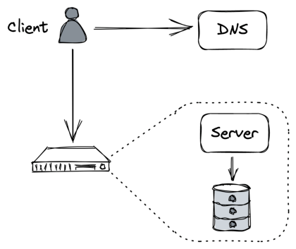
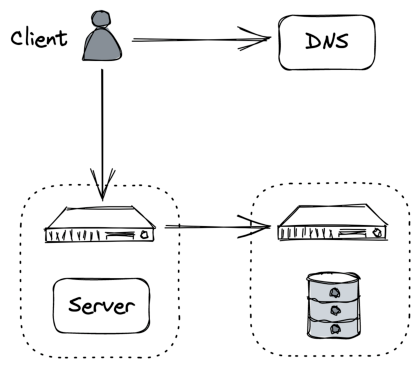

# **Part III** 

**Scalability** 

# **Introduction** 

_“Treat servers like cattle, not pets.”_ 

– Bill Baker 

Over the last few decades, the number of people with access to the internet has steadily climbed. In 1996, only 1% of people worldwide had access to the internet, while today, it’s over 65%. In turn, this has increased the total addressable market of online businesses and led to the need for scalable systems that can handle millions of concurrent users. 

For an application to scale, it must run without performance degradations as load increases. And as mentioned in chapter 1, the only long-term solution for increasing the application’s capacity is to architect it so that it can scale horizontally. 

In this part, we will walk through the journey of scaling a simple CRUD web application called _Cruder_ . _Cruder_ is comprised of a single-page JavaScript application that communicates with an application server through a RESTful HTTP API. The server uses the local disk to store large files, like images and videos, and a relational database to persist the application’s state. Both the database and the application server are hosted on the same machine, which is managed by a compute platform like AWS EC2. Also, the server’s public IP address is advertised by a managed DNS service, like AWS Route 53[14] . 

14“Amazon Route 53,” https://aws.amazon.com/route53/ 

Users interact with _Cruder_ through their browsers. Typically, a browser issues a DNS request to resolve the domain name to an IP address (if it doesn’t have it cached already), opens a TLS connection with the server, and sends its first HTTP _GET_ request to it (see Figure 13.2). 

Figure 13.2: Cruder’s architecture 

Although this architecture is good enough for a proof of concept, it’s not scalable or fault-tolerant. Of course, not all applications need to be highly available and scalable, but since you are reading this book to learn how such applications are built, we can assume that the application’s backend will eventually need to serve millions of requests per second. 

And so, as the number of requests grows, the application server will require more resources (e.g., CPU, memory, disk, network) and eventually reach its capacity, and its performance will start to degrade. Similarly, as the database stores more data and serves more queries, it will inevitably slow down as it competes for resources with the application server. 

The simplest and quickest way to increase the capacity is to _scale up_ the machine hosting the application. For example, we could: 

- increase the number of threads capable of running simulta141 neously by provisioning more processors or cores, 

- increase disk throughput by provisioning more disks (RAID), 

- increase network throughput by provisioning more NICs, 

- reduce random disk access latency by provisioning solidstate disks (SSD), 

- or reduce page faults by provisioning more memory. 

The caveat is that the application needs to be able to leverage the additional hardware at its disposal. For example, adding more cores to a single-threaded application will not make much difference. More importantly, when we’ve maxed out on the hardware front, the application will eventually hit a hard physical limit that we can’t overcome no matter how much money we are willing to throw at it. 

The alternative to scaling up is to _scale out_ by distributing the application across multiple nodes. Although this makes the application more complex, eventually it will pay off. For example, we can move the database to a dedicated machine as a first step. By doing that, we have increased the capacity of both the server and the database since they no longer have to compete for resources. This is an example of a more general pattern called _functional decomposition_ : breaking down an application into separate components, each with its own well-defined responsibility (see Figure 13.3). 

As we will repeatedly see in the following chapters, there are other two general patterns that we can exploit (and combine) to build scalable applications: splitting data into partitions and distributing them among nodes ( _partitioning_ ) and replicating functionality or data across nodes, also known as horizontal scaling ( _replication_ ). In the following chapters, we will explore techniques based on those patterns for further increasing _Cruder_ ’s capacity, which require increasingly more effort to exploit. 

Chapter 14 discusses the use of client-side caching to reduce the number of requests hitting the application. 

Chapter 15 describes using a content delivery network (CDN), a geographically distributed network of managed reverse proxies, 

Figure 13.3: Moving the database to its own dedicated machine is an example of functional decomposition to further reduce the number of requests the application needs to handle. 

Chapter 16 dives into partitioning, a technique used by CDNs, and pretty much any distributed data store, to handle large volumes of data. The chapter explores different partitioning strategies, such as range and hash partitioning, and the challenges that partitioning introduces. 

Chapter 17 discusses the benefits of offloading the storage of large static files, such as images and videos, to a managed file store. It then describes the architecture of Azure Storage, a highly available 

Chapter 18 talks about how to increase the application’s capacity by load-balancing requests across a pool of servers. The chapter starts with a simple approach based on DNS and then explores more flexible solutions that operate at the transport and application layers of the network stack. 

Chapter 19 describes how to scale out the application’s relational database using replication and partitioning and the challenges that come with it. It then introduces NoSQL data stores as a solution to these challenges and recounts their evolution since their initial adoption in the industry. 

Chapter 20 takes a stab at discussing caching from a more general point of view by diving into the benefits and pitfalls of putting a cache in front of the application’s data store. Although caching is a deceptively simple technique, it can create subtle consistency and operational issues that are all too easy to dismiss. 

Chapter 21 talks about scaling the development of the application across multiple teams by decomposing it into independently deployable services. Next, it introduces the concept of an API gateway as a means for external clients to communicate with the backend after it has been decomposed into separated services. 

Chapter 22 describes the benefits of separating the serving of client requests ( _data plane_ ) from the management of the system’s metadata and configuration ( _control plane_ ), which is a common pattern in large-scale systems. 

Chapter 23 explores the use of asynchronous messaging channels to decouple the communication between services, allowing two services to communicate even if one of them is temporarily unavailable. Messaging offers many other benefits, which we will explore in the chapter along with its best practices and pitfalls. 

